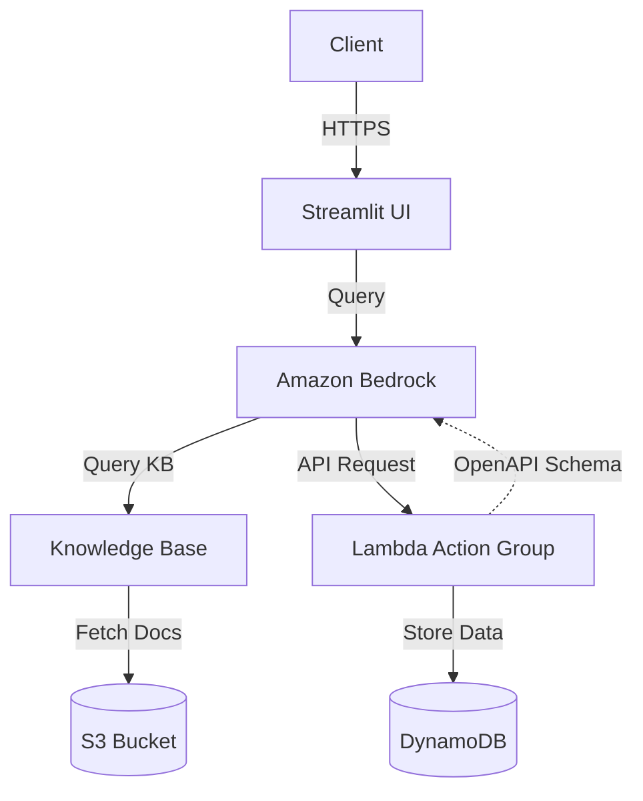

# CDK Helpdesk Chatbot

A serverless helpdesk chatbot implementation using AWS CDK that demonstrates natural language interactions with your knowledge base. The chatbot leverages AWS services to provide intelligent responses to user queries based on your organization's documentation and knowledge articles.

## Overview

This project implements a conversational AI chatbot that can:
- Answer questions based on your organization's knowledge base
- Handle customer support inquiries
- Interacts with tickets and user information through action groups

## Architecture

The solution consists of the following components:




## Key Components
- Streamlit UI : Web interface for interacting with the chatbot
- Amazon Bedrock : Provides the AI/ML capabilities and orchestrates the conversation
- Lambda Action Group : Handles custom actions and API integrations
- DynamoDB : Stores business data
- S3 Bucket : Stores the knowledge base documents

## Prerequisites
- AWS Account and AWS CLI configured
- Node.js 18.x or later
- Python 3.8 or later
- projen installed ( npm install -g projen)
- AWS CDK CLI installed ( npm install -g aws-cdk)
  
## Installation
- Clone the repository:

```
git clone <repository-url>
cd cdk-helpdesk-chatbot
```

- initialise the project

```
npx projen install
```

- add any additional knowledge base documents if so desired in the `src/backend/kbContent` directory

- build the openAPI schemas (note: this is done as part of `npx projen build`)

```
npx projen schema
```

- bootstrap your account (if required)

```
cdk bootstrap
```

- build and deploy 

```
npx projen build && npx projen deploy --all
```

Note: This stack is configured to always deploy in us-east-1 due to service availability. If you want to change this, edit `src/main.ts`

- Onboard your domain to cloudfrontsigner (https://cloudfrontsigner.ninjas.security.a2z.com/)

## Testing locally

- Authenticate to your AWS account where the services are deployed
- Start the streamlit UI
```
cd src/stacks/frontend/streamlit-app
pip install -r requirements.txt
streamlit run app.py
```
- access the UI at http://localhost:8501


## Cleanup

To remove all deployed resources run

```
cdk destroy --all
```

## Todo


