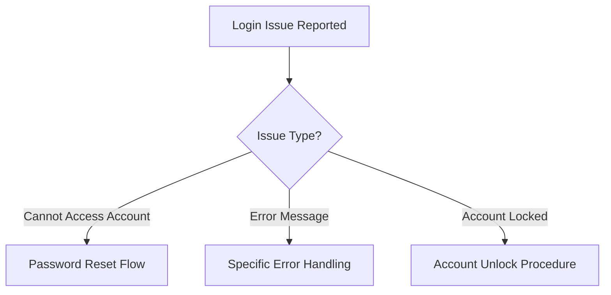

# Account Login Issues - Guide to Troubleshooting Customer Portal Access

## Overview
This runbook provides step-by-step troubleshooting guidance for customers experiencing login difficulties with our online customer portal.

## Troubleshooting Decision Tree

## 1. Password Reset Workflow

### A. Web Browser Password Reset
1. Navigate to https://customerportal.isp.com
2. Click "Forgot Password" link
3. Enter registered email address
4. Check email for reset link
   - Link valid for 30 minutes
   - Check spam/junk folder if not received

### B. Alternative Reset Methods
- SMS password reset
- Phone verification
- Security questions

## 2. Common Error Messages

### 2.1 "Invalid Credentials"
- Verify correct username/email
- Check Caps Lock status
- Ensure no extra spaces in login
- Reset password if persistent

### 2.2 "Account Locked"
- 5 consecutive failed login attempts triggers 30-minute lockout
- Wait 30 minutes
- Use "Forgot Password" link
- Contact support if issue continues

## 3. Browser & Device Troubleshooting

### Supported Browsers
- Chrome (Latest 2 versions)
- Firefox (Latest 2 versions)
- Safari (Latest 2 versions)
- Edge (Latest 2 versions)

### Recommended Troubleshooting Steps
1. Clear browser cache/cookies
2. Disable browser extensions
3. Try incognito/private browsing mode
4. Update browser to latest version

## 4. Technical Requirements

### Minimum System Requirements
- Internet Connection: 1 Mbps+
- Browser: HTML5 compatible
- JavaScript: Enabled
- Cookies: Enabled

## 5. Security Recommendations

### Account Protection
- Use strong, unique password
- Enable two-factor authentication
- Avoid public/shared computers
- Log out after each session

## 6. Escalation Path

### When to Contact Support
- 3+ failed reset attempts
- Persistent lockout
- Suspected account compromise
- Technical errors not resolved by guide

### Support Contact Information
- Phone: 1-800-HELP-ISP
- Email: support@isp.com
- Live Chat: Available 24/7 on website

## Appendix: Troubleshooting Codes

| Code | Description | Recommended Action |
|------|-------------|-------------------|
| ERR_AUTH_001 | Invalid Credentials | Reset Password |
| ERR_AUTH_002 | Account Locked | Wait 30 minutes |
| ERR_AUTH_003 | Browser Incompatibility | Update/Change Browser |

## Version Control
- Document Version: 1.2
- Last Updated: 2023-11-15
- Review Cycle: Quarterly

## Legal Notice
This guide is proprietary and confidential. Unauthorized reproduction prohibited.