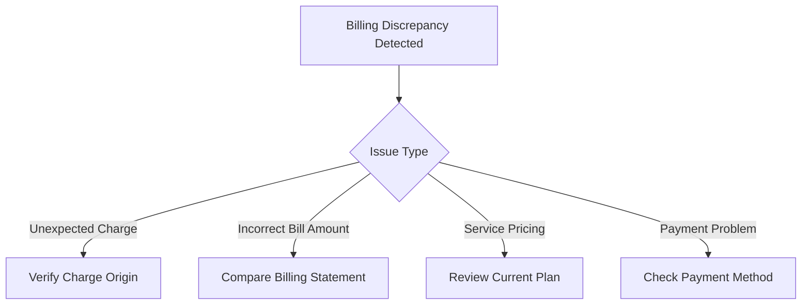

# Billing Discrepancies - Troubleshooting Runbook

## Overview
This runbook provides comprehensive guidance for customers experiencing billing discrepancies, unexpected charges, or billing-related concerns.

## Decision Tree: Billing Issue Identification

## Troubleshooting Workflow

### 1. Unexpected Charges
#### Possible Causes
- Unrecognized service additions
- Prorated charges
- Equipment fees
- Overages

#### Recommended Actions
1. Review detailed billing statement
2. Check service history
3. Verify account changes

### 2. Incorrect Bill Amount Verification
#### Step-by-Step Check
- [ ] Compare current bill to previous months
- [ ] Validate service package details
- [ ] Check for recent plan modifications
- [ ] Verify promotional pricing expiration

### 3. Service Pricing Investigation
#### Resolution Paths
- Contact customer support
- Review online account portal
- Check current rate card
- Confirm contract terms

### 4. Payment Method Problems
#### Troubleshooting Checklist
- [ ] Validate payment method status
- [ ] Check credit card/bank account validity
- [ ] Verify payment processing
- [ ] Confirm automatic payment settings

## Technical Reference

### Common Billing Scenarios
| Scenario | Potential Cause | Recommended Action |
|----------|-----------------|-------------------|
| Unexpected Fees | Service add-ons | Review account changes |
| Billing Calculation Error | System glitch | Request manual review |
| Prorated Charges | Mid-cycle service changes | Verify service modification date |

## Self-Service Resolution Options

1. Online Account Management Portal
   - View detailed billing history
   - Download billing statements
   - Update payment methods

2. Automated Phone System
   - Billing information retrieval
   - Payment processing
   - Account status verification

3. Mobile App Features
   - Real-time billing insights
   - Instant payment options
   - Usage tracking

## Escalation Criteria
Escalate to support representative if:
- Discrepancy exceeds $50
- Multiple billing cycles affected
- Unresolvable through self-service channels

## Documentation Requirements
When contacting support, prepare:
- Account number
- Specific billing statement
- Detailed description of discrepancy
- Screenshots/relevant documentation

## Contact Information
- Technical Support: 1-800-SUPPORT
- Billing Department: 1-888-BILLING
- Online Support: www.example.com/support

## Appendix: Billing Terminology
- Prorated Charge: Partial period billing
- Recurring Charge: Regular scheduled billing
- One-time Fee: Single billing event

## Version Control
- Document Version: 1.2
- Last Updated: [Current Date]
- Approved By: Billing Operations Team

---

**Note:** This runbook is a general guide. Individual account specifics may require personalized investigation.