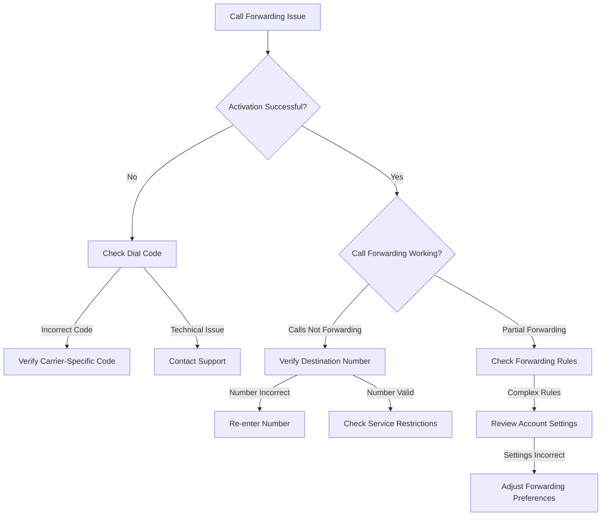

# Call Forwarding Configuration Runbook

## Overview
This runbook provides comprehensive guidance for configuring call forwarding on landline phones across different service types and device configurations.

## Supported Device Types
- Analog landline phones
- Digital landline phones
- VoIP phone systems
- Carrier-provided landline services

## Prerequisites
- Active landline service
- Phone handset
- Access to phone keypad
- Account credentials (if required)

## Call Forwarding Configuration Methods

### Method 1: Standard Dial Code Activation
1. Lift handset and listen for dial tone
2. Dial call forwarding activation code
   - Unconditional Forwarding: `*72`
   - Busy Line Forwarding: `*90`
   - No Answer Forwarding: `*92`
3. Enter destination phone number
4. Wait for confirmation tone

### Method 2: Phone Menu Configuration
1. Access phone system menu
2. Navigate to:
   - Call Settings
   - Call Forwarding
   - Forwarding Options
3. Select forwarding type
4. Enter destination number
5. Save configuration

## Troubleshooting Flowchart

## Common Error Codes and Solutions

| Error Code | Description | Resolution |
|-----------|-------------|------------|
| F01 | Invalid Forwarding Number | Verify number format |
| F02 | Service Restriction | Check account permissions |
| F03 | Network Configuration Issue | Contact support |

## Carrier-Specific Codes

### Major Carriers
- AT&T: `*72`
- Verizon: `*71`
- CenturyLink: `*72`
- Spectrum: `*72`

## Advanced Configuration

### VoIP and Digital Phone Systems
1. Access web portal/configuration interface
2. Navigate to call routing settings
3. Configure:
   - Forwarding rules
   - Time-based forwarding
   - Simultaneous ring
   - Number of rings before forwarding

## Limitations
- Emergency services may not support forwarding
- International forwarding might incur additional charges
- Some advanced features require specific service plans

## Support Escalation
If unable to resolve:
1. Gather:
   - Account number
   - Phone number
   - Detailed issue description
2. Contact technical support
3. Provide troubleshooting steps attempted

## Recommended Tools
- Phone manual
- Account web portal
- Carrier support contact information

## Revision History
- Version 1.0: Initial Release
- Last Updated: [Current Date]

## Legal Disclaimer
Configuration may vary by carrier and service plan. Consult specific carrier documentation for precise instructions.