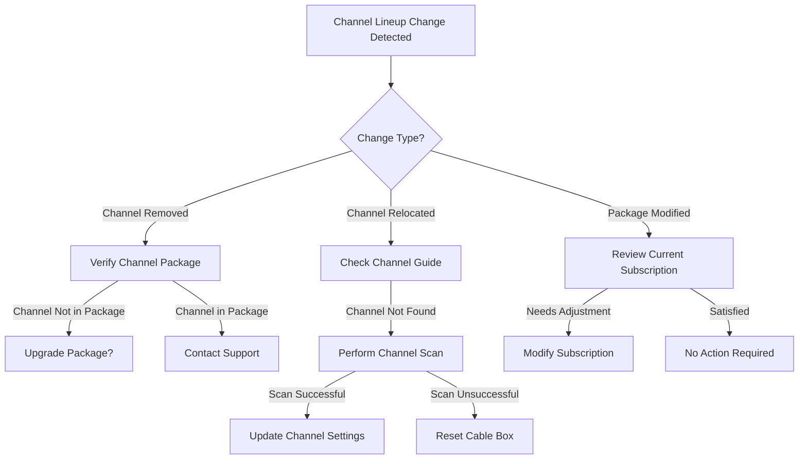

# Channel Lineup Changes - Guide to Understanding and Adapting to Changes in TV Channel Lineups

## Overview
This runbook provides comprehensive guidance for customers experiencing or inquiring about channel lineup modifications.

## Table of Contents
1. Understanding Lineup Changes
2. Troubleshooting Steps
3. Notification and Communication
4. Channel Relocation Process
5. Frequently Asked Questions

## 1. Understanding Lineup Changes

### Reasons for Channel Lineup Modifications
- Contract negotiations
- Network restructuring
- Regulatory changes
- Technological upgrades

### Types of Changes
- Channel removal
- Channel relocation
- Channel package modifications
- HD/SD channel transitions

## 2. Troubleshooting Workflow

### Decision Tree: Channel Lineup Issues

## 3. Technical Troubleshooting Steps

### Channel Relocation
1. Perform a full channel scan
   - Settings > Channel Setup > Scan Channels
2. Check signal strength
   - Settings > Signal Diagnostics
3. Verify cable connections
   - Inspect coaxial and HDMI connections

### Device-Specific Instructions

#### Smart TVs
- Samsung
  - Menu > Channel > Auto Tuning
- LG
  - Settings > Channel > Channel Scan
- Vizio
  - Menu > TV > Channel Scan

#### Cable Boxes
- Motorola
  - Menu > Setup > Channel Scan
- Scientific Atlanta
  - Settings > Channels > Rescan
- Cisco
  - Home > Settings > Channel Setup

## 4. Communication Channels

### Notification Methods
- Email notifications
- SMS alerts
- In-app messages
- Website announcements

### Information Included
- Date of change
- Affected channels
- New channel locations
- Potential impact on service

## 5. Customer Support Options

### Self-Service Channels
- Online account portal
- Mobile app
- Interactive voice response (IVR)

### Direct Support
- Phone support: 1-800-CHANNELS
- Live chat
- Email support

## 6. Frequently Asked Questions (FAQ)

### Q: Why did my channels change?
A: Channel changes can result from contract negotiations, network decisions, or technological upgrades.

### Q: How can I find my new channel locations?
A: Perform a channel scan or check the online channel guide.

### Q: Will I be charged for these changes?
A: Most lineup changes do not incur additional costs unless you modify your package.

## Troubleshooting Checklist

### Pre-Troubleshooting
- [ ] Confirm date of lineup change
- [ ] Identify specific channel issues
- [ ] Check current subscription details

### Technical Verification
- [ ] Perform full channel scan
- [ ] Check cable connections
- [ ] Verify signal strength
- [ ] Reset cable box if necessary

## Additional Resources
- Channel lineup webpage
- Support knowledge base
- Video tutorials
- Community forums

## Version Control
- Version: 1.2
- Last Updated: [Current Date]
- Revision Notes: Added device-specific scanning instructions

## Contact Information
Technical Support: support@ispchannels.com
24/7 Helpline: 1-800-CHANNELS

---

**Disclaimer:** Specific steps may vary based on individual device and service configurations.