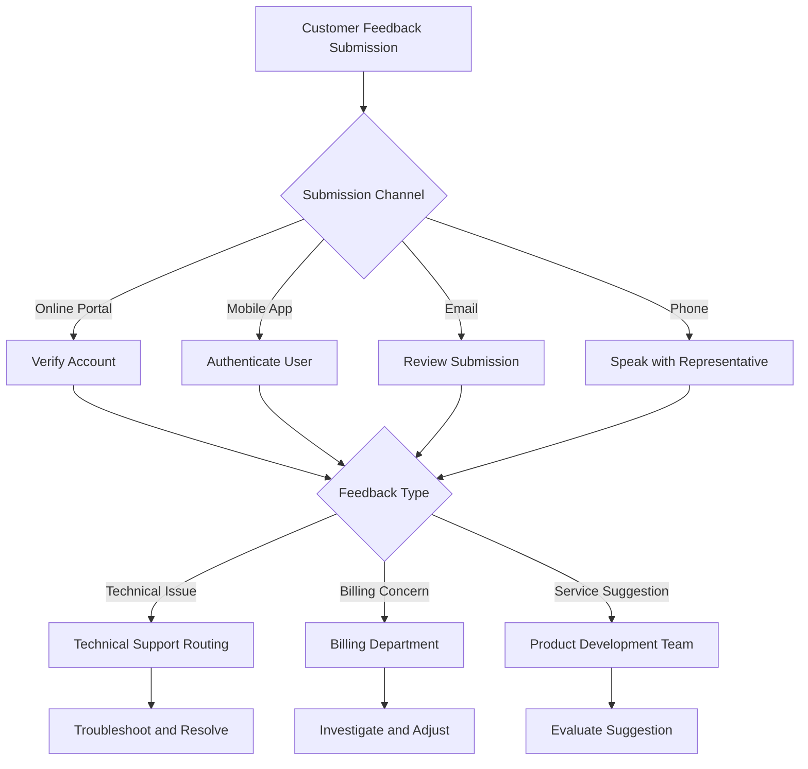

# Customer Feedback Submission - Technical Support Runbook

## Purpose
This runbook provides customers with comprehensive guidance on submitting feedback, reporting issues, and providing suggestions to improve our Internet Service Provider (ISP) services.

## Feedback Submission Channels

### 1. Online Feedback Portal
- **Access**: 
  - Visit our official website
  - Click on "Customer Support" > "Feedback"
  - Log in with account credentials

#### Submission Steps
1. Select feedback category
   - Technical Support
   - Billing Inquiry
   - Service Improvement
   - Network Performance
   - General Suggestion

2. Provide detailed information
   - Specific service or product reference
   - Detailed description
   - Impact of issue
   - Preferred resolution method

### 2. Mobile App Feedback
- **Mobile App Submission**
  - Open ISP mobile app
  - Navigate to "Support" > "Feedback"
  - Follow in-app submission process

### 3. Email Submission
- **Email Address**: feedback@ourispservice.com
- **Required Information**:
  - Full Name
  - Account Number
  - Contact Phone Number
  - Detailed Description
  - Preferred Contact Method

### 4. Telephone Support
- **Support Hotline**: 1-800-ISP-HELP
- **Hours**: 
  - Monday-Friday: 8am-8pm
  - Saturday-Sunday: 10am-6pm
- **Information Needed**:
  - Account Verification
  - Detailed Issue Description
  - Preferred Resolution Method

## Feedback Tracking Process

### Feedback Categories
1. **Technical Issues**
   - Network Connectivity
   - Speed Performance
   - Equipment Malfunction
   - Service Interruptions

2. **Billing Concerns**
   - Charge Disputes
   - Billing Errors
   - Payment Complications
   - Service Plan Inquiries

3. **Service Improvement**
   - Feature Suggestions
   - User Experience
   - Coverage Expansion
   - New Service Recommendations

## Escalation Matrix

### Feedback Prioritization
- **Severity Levels**:
  1. Critical (Immediate Action Required)
  2. High Priority
  3. Medium Impact
  4. Low Priority

### Response Timeframes
- Critical Issues: Within 2 hours
- High Priority: Within 24 hours
- Medium Impact: Within 48 hours
- Low Priority: Within 5 business days

## Customer Feedback Decision Tree

## Best Practices
- Be specific and concise
- Provide supporting documentation
- Include relevant account information
- Maintain professional communication

## Follow-up Expectations
- Acknowledgement email within 24 hours
- Tracking number provided
- Regular status updates
- Resolution communication

## Privacy and Data Protection
- All feedback treated confidentially
- Compliance with data protection regulations
- Secure submission channels

## Contact Information
- **Website**: www.ourispservice.com/support
- **Phone**: 1-800-ISP-HELP
- **Email**: feedback@ourispservice.com

---

**Version**: 1.2
**Last Updated**: [Current Date]
**Revision Frequency**: Quarterly