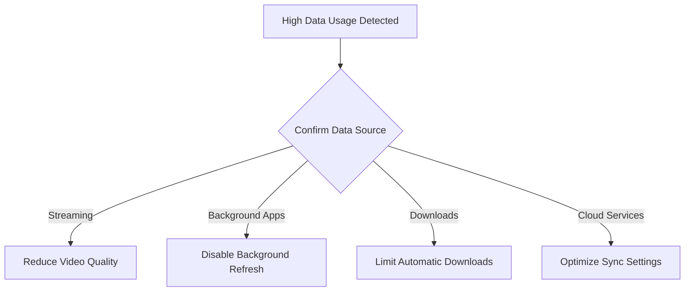

# Data Usage Monitoring - Customer Self-Service Guide

## Overview
This comprehensive guide helps customers understand, monitor, and manage their data usage across various devices and platforms.

## Table of Contents
1. [Understanding Data Usage](#understanding-data-usage)
2. [Checking Data Usage](#checking-data-usage)
3. [Troubleshooting High Data Consumption](#troubleshooting-high-data-consumption)
4. [Managing Data Plans](#managing-data-plans)
5. [Device-Specific Instructions](#device-specific-instructions)

## Understanding Data Usage

### What Counts as Data Usage?
- Streaming video/music
- Downloading/uploading files
- Web browsing
- Social media
- Email with attachments
- Video calls
- App updates
- Cloud backup services

### Data Usage Metrics
- Measured in bytes (B)
- Typically displayed in:
  - Megabytes (MB)
  - Gigabytes (GB)

## Checking Data Usage

### Online Account Portal
1. Visit [account.ourispname.com]
2. Log in with credentials
3. Navigate to "Data Usage" section
4. View current billing cycle usage

### Mobile Device Methods

#### iOS
- Settings > Cellular
- Settings > Mobile Data

#### Android
- Settings > Network & Internet
- Settings > Connections > Data Usage

#### Windows
- Settings > Network & Internet
- Click "Data Usage" tab

#### macOS
- System Preferences > Network
- Select connection, view data metrics

## Troubleshooting High Data Consumption

### Decision Tree for Data Usage Investigation

### Recommended Actions
1. **Identify High-Usage Applications**
   - Check data usage by individual apps
   - Disable background data for non-essential apps

2. **Optimize Streaming**
   - Reduce video quality
   - Use Wi-Fi for streaming
   - Download content instead of streaming

3. **Manage Automatic Updates**
   - Set app updates to Wi-Fi only
   - Disable automatic OS updates
   - Schedule updates during unlimited data periods

## Managing Data Plans

### Proactive Monitoring Strategies
- Set data usage alerts
- Enable automatic warnings
- Consider plan upgrades if consistently exceeding limit

### Data Saving Techniques
- Use Wi-Fi whenever possible
- Download content for offline use
- Use data compression browsers
- Disable auto-play videos

## Device-Specific Instructions

### Smartphones
- iOS: Settings > Cellular > Reset Statistics
- Android: Settings > Network > Data Usage > Reset

### Computers
- Windows: Settings > Network > Data Usage
- macOS: Activity Monitor > Network tab

### Tablets
- Similar to smartphone instructions
- Check individual device settings

## Advanced Troubleshooting

### Common Scenarios
1. **Unexpected Data Spike**
   - Check connected devices
   - Scan for potential malware
   - Review recent app installations

2. **Continuous Overages**
   - Contact customer support
   - Review current plan
   - Consider plan modification

## Contact Support
- Phone: 1-800-OURISPHELP
- Email: support@ourispname.com
- Live Chat: Available 24/7 on website

## Disclaimer
- Data usage measurements may have slight variations
- Always verify with official account portal
- Contact support for precise billing information

---

**Last Updated:** [Current Date]
**Version:** 2.1