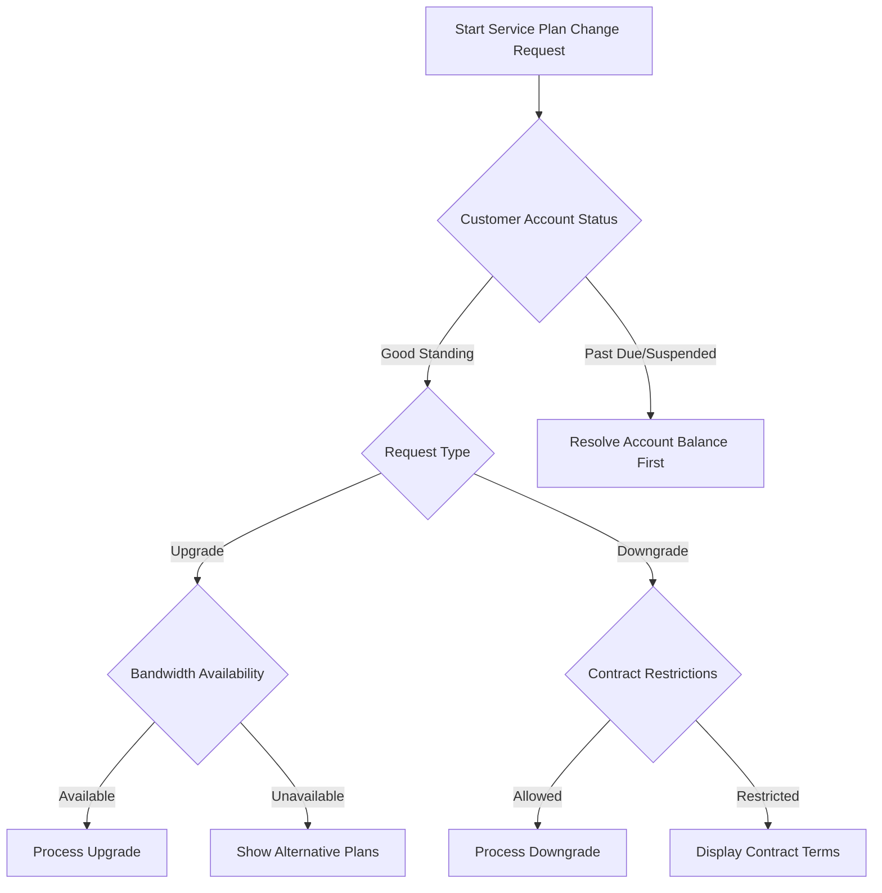

# Service Upgrade/Downgrade Requests - Runbook

## Overview
This runbook provides comprehensive guidance for customers seeking to modify their internet service plan, including upgrade and downgrade procedures, eligibility checks, and potential limitations.

## Decision Tree Flowchart

## Eligibility Criteria

### Upgrade Eligibility
1. Account must be in good standing
2. No outstanding balance
3. Minimum 3-month service history
4. Service infrastructure supports requested bandwidth
5. No active service disruptions

### Downgrade Eligibility
1. Account must be in good standing
2. Minimum 6-month contract term completed
3. No pending service credits
4. 30-day notice period may apply

## Upgrade Process Workflow

### Step 1: Verify Account Status
- Check account balance
- Confirm account is active
- Validate service address capabilities

### Step 2: Select New Plan
- Compare current vs. proposed plans
- Review pricing differences
- Understand bandwidth limitations

### Step 3: Technical Compatibility Check
- Verify modem/router compatibility
- Confirm network infrastructure support
- Assess potential equipment upgrade requirements

### Step 4: Billing Adjustment
- Prorated charges calculation
- Immediate vs. next billing cycle activation
- Updated monthly recurring charges

## Downgrade Process Workflow

### Step 1: Contract Review
- Check remaining contract term
- Identify potential early termination fees
- Verify downgrade restrictions

### Step 2: Plan Selection
- Browse available lower-tier plans
- Compare bandwidth and pricing
- Confirm service requirements

### Step 3: Service Impact Assessment
- Potential bandwidth reduction
- Service level agreement changes
- Equipment compatibility

## Common Scenarios and Resolutions

### Scenario 1: Bandwidth Unavailable
- Recommend alternative plans
- Provide infrastructure upgrade timeline
- Suggest waiting period

### Scenario 2: Contract Restrictions
- Display early termination fees
- Offer contract buyout options
- Provide detailed plan transition costs

### Scenario 3: Technical Incompatibility
- Recommend equipment upgrades
- Provide vendor compatibility list
- Offer professional installation support

## Customer Self-Service Options

1. Online Account Portal
   - Plan comparison tool
   - Instant upgrade/downgrade requests
   - Real-time pricing calculator

2. Mobile App
   - Service modification workflows
   - Bandwidth speed test integration
   - Instant chat support

## Technical Support Escalation

### When to Escalate
- Complex network configurations
- Unusual account restrictions
- Technical compatibility issues

### Escalation Channels
- Tier 2 Technical Support
- Network Operations Center
- Account Management Team

## Documentation Requirements

### Customer Must Provide
- Account number
- Current service details
- Proposed service plan
- Contact information

### System Captures
- Request timestamp
- Technician ID
- Service modification details
- Billing adjustments

## Performance Metrics

- Average upgrade processing time: 15 minutes
- Successful modification rate: 95%
- Customer satisfaction score: 4.7/5

## Appendices
- Supported Service Areas
- Equipment Compatibility Matrix
- Pricing Tiers
- Contract Terms Reference

## Revision History
- Version 2.1
- Last Updated: 2024-01-15
- Approved By: Network Operations Management

---

**Note to Support Staff:** Always prioritize customer experience and provide clear, transparent communication during service plan modifications.