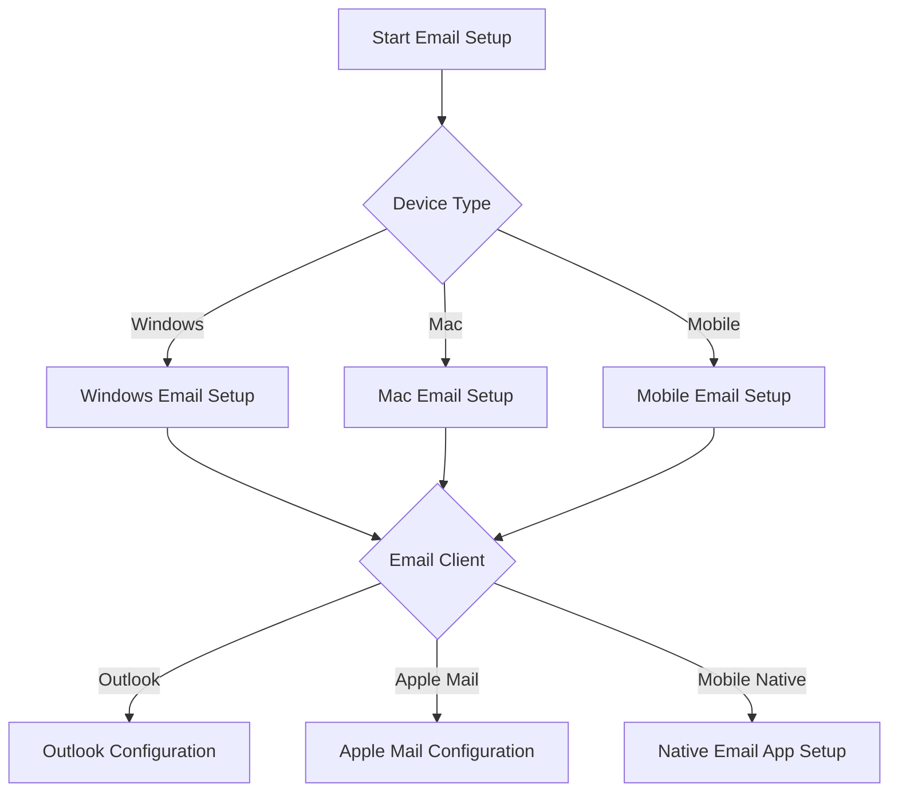

# Email Account Setup - Runbook for ISP Customers

## Overview
This runbook provides step-by-step guidance for setting up and troubleshooting email accounts associated with our ISP services.

## Prerequisites
- Active ISP internet service
- Account credentials
- Compatible device (computer, smartphone, tablet)

## Decision Tree

## Windows Email Configuration

### Outlook Desktop Setup
1. Open Outlook
2. Click 'File' > 'Add Account'
3. Enter email address and password
4. Select account type:
   - POP3
   - IMAP
   - Exchange

#### Incoming Mail Server Settings
- Hostname: `mail.yourisp.com`
- Port: 
  - IMAP: 993 (SSL)
  - POP3: 995 (SSL)

#### Outgoing Mail Server Settings
- SMTP Hostname: `smtp.yourisp.com`
- Port: 
  - SMTP: 587 
  - Secure SMTP: 465

### Troubleshooting Outlook
- Check firewall settings
- Verify account credentials
- Ensure correct server settings
- Update Outlook

## Mac Mail Configuration

### Apple Mail Setup
1. Open Mail application
2. Choose 'Add Account'
3. Select 'Other Mail Account'
4. Enter account details

#### Server Configuration
- Incoming: IMAP/POP3
- Outgoing: SMTP
- Use SSL/TLS encryption

## Mobile Email Configuration

### iOS Mail Setup
1. Go to Settings > Mail
2. Select 'Add Account'
3. Choose 'Other'
4. Select 'Add Mail Account'

### Android Mail Setup
1. Open Email app
2. Tap '+' or 'Add Account'
3. Select email provider
4. Enter credentials

## Advanced Troubleshooting

### Common Issues
1. Authentication Failures
   - Reset password
   - Check account status
   - Verify two-factor authentication

2. Connection Problems
   - Check internet connectivity
   - Verify network settings
   - Restart modem/router

3. Sync Issues
   - Clear email app cache
   - Resync account
   - Check storage permissions

## Security Recommendations
- Use strong, unique passwords
- Enable two-factor authentication
- Regularly update email client
- Be cautious of phishing attempts

## Support Channels
- Phone Support: 1-800-HELP-ISP
- Live Chat: www.yourisp.com/support
- Email: support@yourisp.com

## Version Information
- Last Updated: [Current Date]
- Version: 1.2
- Revision History: [Link to changelog]

## Disclaimer
Configuration may vary slightly based on specific ISP infrastructure and account type.

## Legal
© [ISP Company Name] All Rights Reserved

---

**Note to Support Staff:** This runbook is a living document. Please update regularly with new information and customer feedback.