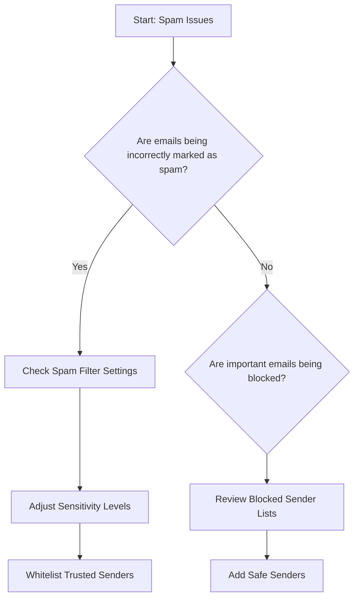

# Email Spam Filtering - Guide to Configuring Spam Protection

## Table of Contents
1. [Introduction](#introduction)
2. [Spam Filtering Basics](#spam-filtering-basics)
3. [Troubleshooting Decision Tree](#troubleshooting-decision-tree)
4. [Configuration Steps](#configuration-steps)
   - [Web-Based Email](#web-based-email)
   - [Email Clients](#email-clients)
5. [Advanced Settings](#advanced-settings)
6. [Troubleshooting Common Issues](#troubleshooting-common-issues)

## Introduction
This guide provides comprehensive instructions for configuring and managing email spam filtering across various email platforms and clients.

## Spam Filtering Basics
Spam filtering helps protect your inbox from unwanted, potentially harmful emails by:
- Identifying suspicious email patterns
- Blocking known spam sources
- Preventing phishing attempts
- Reducing inbox clutter

## Troubleshooting Decision Tree



## Configuration Steps

### Web-Based Email

#### Gmail
1. Open Gmail settings
2. Navigate to 'Filters and Blocked Addresses'
3. Create custom filters
   - Click 'Create new filter'
   - Set criteria for blocking/allowing emails

#### Outlook Web
1. Click gear icon > View all Outlook settings
2. Select 'Junk email'
3. Configure blocking options
   - Add blocked domains
   - Adjust spam sensitivity

### Email Clients

#### Microsoft Outlook Desktop
1. Go to Home > Junk Email Options
2. Select protection level
   - Low
   - Normal
   - High
3. Manage blocked senders list

#### Apple Mail
1. Preferences > Junk Mail
2. Enable automatic filtering
3. Customize filter settings

## Advanced Settings

### Spam Filter Configuration
- Sensitivity Levels
- Sender Reputation Scoring
- Machine Learning Filters
- Content-Based Filtering

### Custom Rules Examples
```
IF (sender_domain == suspicious_domain)
THEN move_to_spam()

IF (email_contains: 'urgent payment', 'lottery')
THEN move_to_spam()
```

## Troubleshooting Common Issues

### Scenario 1: False Positives
- Symptoms: Important emails marked as spam
- Solutions:
  1. Check spam folder regularly
  2. Add sender to safe list
  3. Adjust filter sensitivity

### Scenario 2: Excessive Spam
- Symptoms: Too many spam emails in inbox
- Solutions:
  1. Update spam filter settings
  2. Block specific sender domains
  3. Use advanced content filtering

## Best Practices
- Regularly review spam folder
- Never click links in suspicious emails
- Keep email client updated
- Use strong, unique passwords

## Support Resources
- [Customer Support Portal](#)
- Email: support@isp.com
- Phone: 1-800-HELP-ISP

## Technical Specifications
- Supported Platforms: Web, Desktop, Mobile
- Filtering Technologies:
  - Machine Learning
  - Bayesian Filtering
  - Reputation-Based Blocking

---

*Last Updated: [Current Date]*
*Version: 2.1*