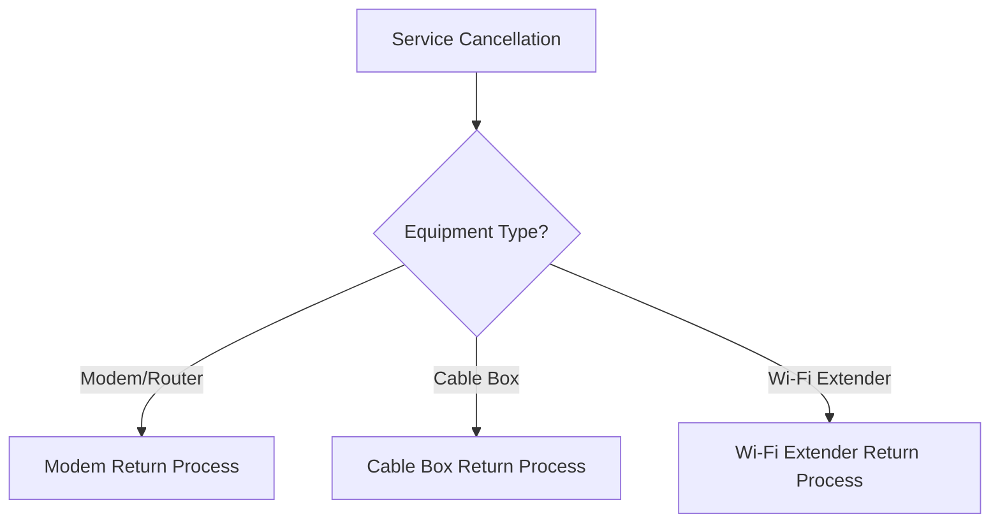

# Equipment Return Process - Instructions for Customers Returning Rented Equipment

## Overview
This guide provides step-by-step instructions for returning rented equipment after service cancellation.

## Decision Tree Flowchart

## Modem/Router Return Options

### Option 1: Drop-off at Local Service Center
1. Locate nearest service center
   - Visit our website: www.isp.com/locations
   - Enter zip code to find closest location
2. Bring:
   - Original equipment
   - Account number
   - Valid photo ID
3. Receive return confirmation receipt

### Option 2: Mail-in Return
1. Request prepaid shipping label
   - Online: www.isp.com/return
   - Phone: 1-800-SUPPORT
2. Packaging requirements
   - Original box preferred
   - Bubble wrap if original packaging unavailable
   - Include account number inside package
3. Shipping instructions
   - Attach provided shipping label
   - Drop at local post office or shipping center
   - Keep tracking number for records

## Cable Box Return Process
1. Disconnect all cables
2. Remove any personal recordings
3. Return via:
   - Local service center
   - Authorized retailer
   - Prepaid shipping label

## Wi-Fi Extender Return Process
1. Unplug from power source
2. Reset to factory settings
3. Return methods same as modem return

## Common Return Issues & Resolutions

### Damaged Equipment
- Document damage with photos
- Contact support for assessment
- Potential partial/full replacement fee

### Missing Equipment Components
- Return all original accessories
- Power adapters
- Ethernet cables
- Remote controls

## Timeframe & Fees
- Return within 14 days of service cancellation
- Late returns may incur additional charges
- Unreturned equipment charged at full replacement cost

## Contact Information
- Customer Support: 1-800-SUPPORT
- Online Support: www.isp.com/support
- Email: support@isp.com

## Confirmation & Receipt
- Expect email confirmation within 3-5 business days
- Check final bill for equipment return status

## Troubleshooting Checklist
- [ ] Confirmed service cancellation
- [ ] Gathered all equipment
- [ ] Reset to factory settings
- [ ] Backup any personal data
- [ ] Selected return method
- [ ] Obtained return label/confirmation

## Additional Resources
- Video tutorials
- Equipment return FAQs
- Live chat support

---

*Last Updated: [Current Date]*
*Version: 1.2*