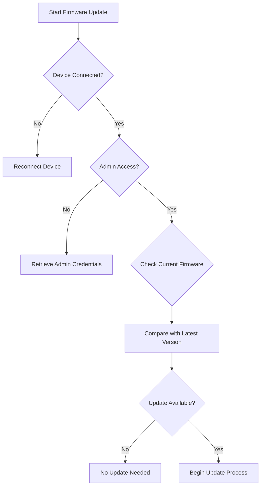

# Firmware Update Procedures - Customer Self-Service Guide

## Overview
This guide provides step-by-step instructions for updating firmware on ISP-provided routers and modems to ensure optimal network performance, security, and functionality.

## Compatibility
- Supported Devices:
  - All ISP-issued Netgear, Cisco, Arris, and TP-Link routers
  - Compatible with Windows, macOS, iOS, and Android management interfaces

## Firmware Update Decision Tree

## Preparation Checklist
- [ ] Stable internet connection
- [ ] Device admin credentials
- [ ] Minimum 15-20 minutes of uninterrupted time
- [ ] Backup current device configuration

## Firmware Update Methods

### Method 1: Web Interface Update
1. Open web browser
2. Enter router IP (typically 192.168.1.1 or 192.168.0.1)
3. Login with admin credentials
4. Navigate to:
   - `Administration`
   - `Firmware Update`
   - `Check for Updates`

### Method 2: Mobile App Update
1. Download official ISP router management app
2. Login to account
3. Select device
4. Tap `Firmware` or `System Update`
5. Follow on-screen prompts

### Method 3: Automatic Update
- Enable automatic updates in device settings
- Recommended for most customers

## Troubleshooting Update Issues

### Common Update Failures
1. **Connection Interrupted**
   - Restart update process
   - Ensure stable internet connection
   - Disable VPN temporarily

2. **Insufficient Storage**
   - Clear device cache
   - Remove unnecessary configurations
   - Contact support if persistent

3. **Version Compatibility**
   - Verify device model matches firmware
   - Download specific firmware version from ISP support portal

## Post-Update Verification
- [ ] Confirm successful installation
- [ ] Verify network connectivity
- [ ] Check device performance
- [ ] Reboot router if recommended

## Technical Requirements
- Minimum free storage: 50MB
- Recommended update frequency: Quarterly
- Supported firmware versions: Latest 2 releases

## Support Escalation
If update fails after following these steps:
1. Note error message
2. Capture screenshot
3. Contact ISP technical support
4. Provide:
   - Device model
   - Current firmware version
   - Error details

## Security Best Practices
- Always download firmware from official sources
- Verify digital signatures
- Update during low-traffic periods
- Never interrupt firmware installation

## Error Code Reference

| Error Code | Description | Recommended Action |
|-----------|-------------|-------------------|
| FW-101 | Download Failed | Retry download |
| FW-202 | Incompatible Version | Check device compatibility |
| FW-303 | Installation Error | Contact support |

## Disclaimer
- Firmware updates may temporarily interrupt service
- Customer responsible for backing up configurations
- ISP not liable for user-initiated update errors

---

**Last Updated:** [Current Date]
**Version:** 2.1