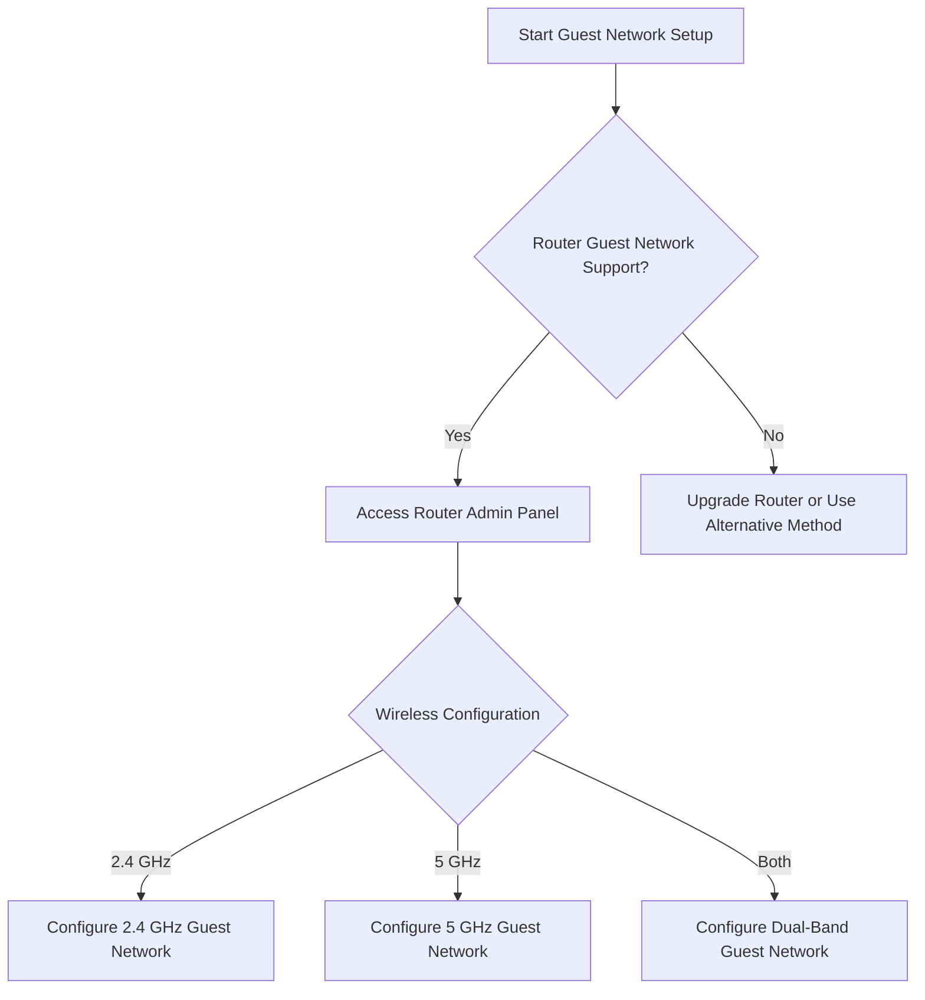
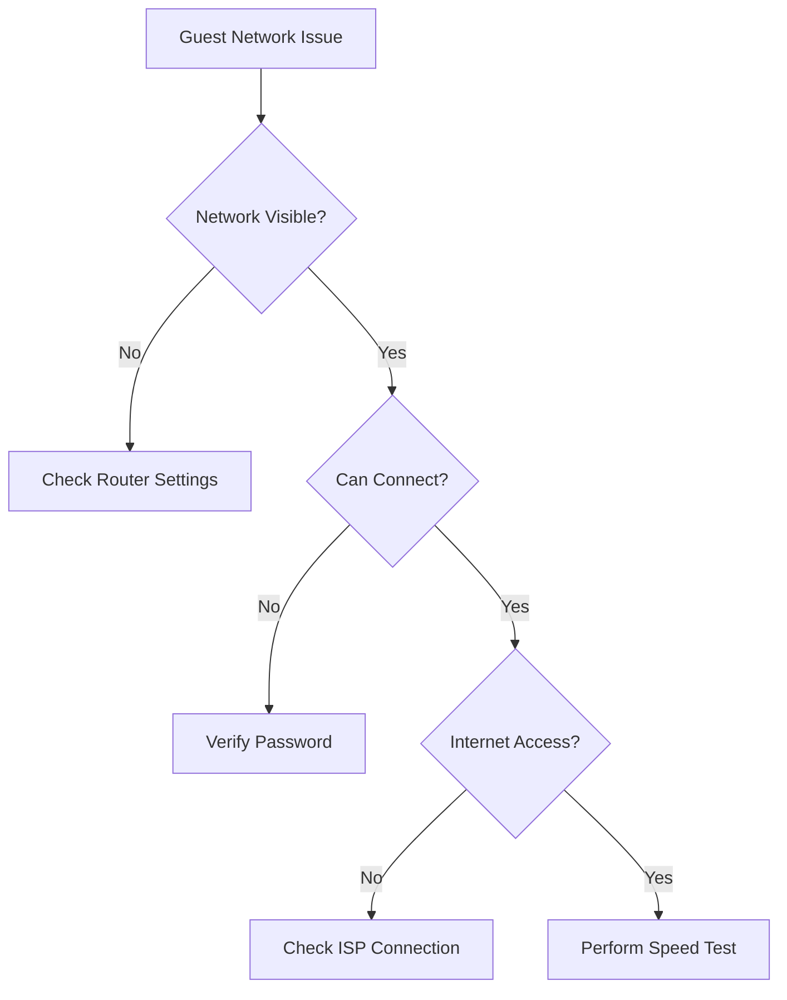

# Guest Network Configuration Runbook

## Overview
This runbook provides comprehensive guidance for setting up, managing, and troubleshooting guest networks for residential and small business internet subscribers.

## Table of Contents
1. [Prerequisites](#prerequisites)
2. [Network Setup](#network-setup)
3. [Configuration Steps](#configuration-steps)
4. [Security Best Practices](#security-best-practices)
5. [Troubleshooting](#troubleshooting)
6. [Common Issues](#common-issues)

## Prerequisites
### Required Equipment
- Compatible router supporting guest network functionality
- Admin access to router settings
- Network credentials

### Supported Router Brands
- Cisco
- Netgear
- TP-Link
- ASUS
- Linksys
- D-Link

## Network Setup Decision Tree

## Configuration Steps

### Method 1: Web-Based Router Configuration
1. Open web browser
2. Enter router IP (typically 192.168.0.1 or 192.168.1.1)
3. Log in with admin credentials
4. Navigate to "Wireless" or "Guest Network" settings
5. Enable guest network
6. Configure network name (SSID)
7. Set security password
8. Apply settings

### Method 2: Mobile App Configuration
1. Download router manufacturer's mobile app
2. Connect to home network
3. Log in to router management
4. Select "Guest Network" option
5. Follow on-screen setup wizard
6. Configure network parameters
7. Save configuration

## Security Best Practices
- Use strong, unique guest network password
- Set bandwidth limitations
- Enable time-based access controls
- Implement MAC address filtering
- Separate guest network from primary network

## Troubleshooting Flowchart

## Common Troubleshooting Scenarios

### Scenario 1: No Guest Network Visible
1. Verify router supports guest networking
2. Restart router
3. Update router firmware
4. Reset to factory settings if necessary

### Scenario 2: Connection Drops
- Check signal strength
- Reduce interference
- Update router firmware
- Adjust wireless channel

### Scenario 3: Limited Bandwidth
- Configure QoS settings
- Set bandwidth limitations
- Upgrade router hardware

## Security Recommendations
- Change default admin passwords
- Use WPA3 encryption
- Regularly update router firmware
- Implement guest network time limits
- Monitor connected devices

## Technical Specifications
- Recommended Guest Network Password Length: 12+ characters
- Recommended Encryption: WPA2/WPA3
- Maximum Concurrent Connections: Varies by router model

## Appendix
- Router Compatibility Chart
- Firmware Download Links
- Manufacturer Support Contacts

## Support Escalation
If unable to resolve:
1. Collect router model
2. Document specific error messages
3. Contact ISP technical support
4. Provide detailed troubleshooting steps attempted

---

**Note:** Always consult your specific router's manual for precise configuration instructions.