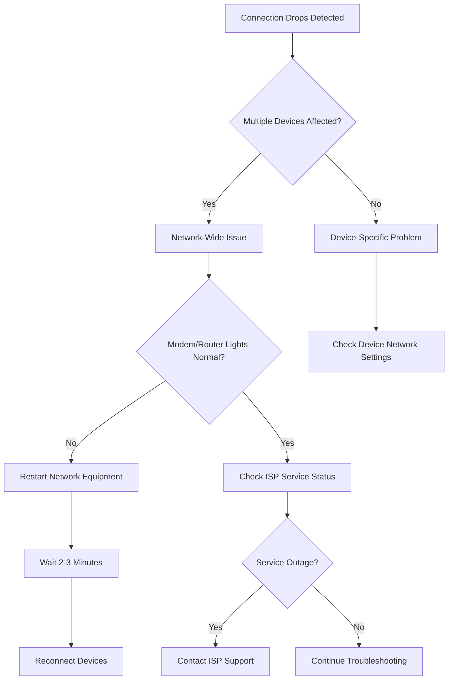

# Internet Connection Drops - Guide to Diagnosing and Resolving Intermittent Internet Connectivity Issues

## Overview
This technical runbook provides step-by-step troubleshooting guidance for customers experiencing intermittent internet connectivity problems.

## Preliminary Checks
### Initial Diagnostics
1. Check Physical Connections
   - Ensure all cables are securely connected
   - Verify power indicators on modem and router are active
   - Inspect for any visible cable damage

2. Device Connectivity Check
   - Test connection on multiple devices
   - Determine if issue is device-specific or network-wide

## Troubleshooting Workflow

### Decision Tree: Connection Drop Diagnosis



## Detailed Troubleshooting Steps

### Network-Wide Issues
1. Modem/Router Restart
   ```bash
   # Power cycle procedure
   - Unplug power from modem and router
   - Wait 60 seconds
   - Reconnect power
   - Wait 2-3 minutes for full reboot
   ```

2. Signal Interference Checks
   - Relocate router away from:
     * Microwave ovens
     * Cordless phones
     * Bluetooth devices
     * Metal objects

3. Wi-Fi Channel Optimization
   - Access router admin panel
   - Switch to less congested Wi-Fi channel
   - Recommended: Channels 1, 6, or 11 for 2.4GHz
   - Use 5GHz band if supported

### Device-Specific Troubleshooting

#### Windows
1. Network Adapter Reset
   ```powershell
   # Open Command Prompt as Administrator
   netsh winsock reset
   netsh int ip reset
   ipconfig /release
   ipconfig /renew
   ```

#### macOS
1. Network Service Diagnostic
   ```bash
   # Terminal commands
   sudo killall -HUP mDNSResponder
   sudo dscacheutil -flushcache
   ```

#### Mobile Devices
1. Airplane Mode Toggle
   - Enable Airplane Mode
   - Wait 30 seconds
   - Disable Airplane Mode
   - Reconnect to Wi-Fi

## Advanced Diagnostics

### Connection Speed and Stability Tests
1. Online Speed Test
   - Use multiple services:
     * Speedtest.net
     * Fast.com
     * Ookla Speed Test

2. Ping Stability Check
   ```bash
   # Continuous ping test
   ping 8.8.8.8 -t  # Windows
   ping -c 100 8.8.8.8  # macOS/Linux
   ```

## Escalation Criteria
Contact ISP Support if:
- Persistent drops after all troubleshooting
- Consistent packet loss > 10%
- Speed consistently below contracted rate
- No improvement after equipment restart

## Recommended Equipment
- CAT6 Ethernet Cables
- Modern Dual-Band Router
- Signal Boosters/Mesh Network Systems

## Support Contact
- ISP Technical Support: 1-800-HELP-NET
- Online Support: support.isp.com
- Support Hours: 24/7

## Version Information
- Document Version: 2.1
- Last Updated: [Current Date]
- Revision Frequency: Quarterly

## Disclaimer
This guide provides general troubleshooting steps. Individual network configurations may vary.

---

**Pro Tip**: Always document your troubleshooting steps and any error messages encountered for more efficient support.