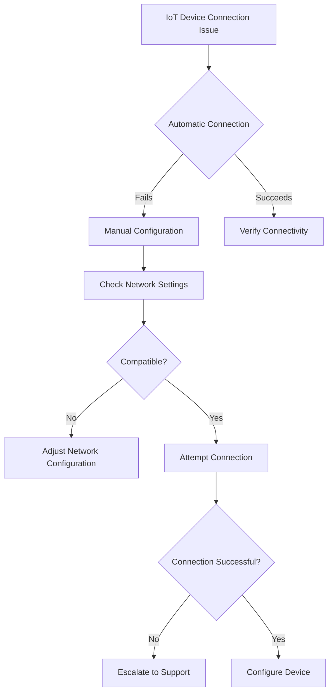

# IoT Device Management Technical Runbook

## Table of Contents
1. [Introduction](#introduction)
2. [Network Compatibility Check](#network-compatibility-check)
3. [Device Connection Troubleshooting](#device-connection-troubleshooting)
4. [Security and Configuration](#security-and-configuration)
5. [Performance Optimization](#performance-optimization)
6. [Troubleshooting Flowchart](#troubleshooting-flowchart)

## Introduction

This runbook provides comprehensive guidance for managing Internet of Things (IoT) devices on home networks, covering connection, configuration, and optimization strategies.

### Supported Device Types
- Smart Home Devices
- Wireless Sensors
- Smart Appliances
- Home Security Systems
- Networked Entertainment Devices

## Network Compatibility Check

### Pre-Connection Checklist
- [ ] Verify router compatibility
- [ ] Check network bandwidth
- [ ] Ensure sufficient IP address pool
- [ ] Confirm Wi-Fi frequency support (2.4 GHz/5 GHz)

### Minimum Network Requirements
- Internet Speed: 25 Mbps
- Router: Modern dual-band (802.11ac or newer)
- Open ports for device management
- DHCP enabled

## Device Connection Troubleshooting

### Connection Methods
1. **Direct Wi-Fi Connection**
   - Locate device's network settings
   - Select home network
   - Enter Wi-Fi password

2. **Mobile App Configuration**
   - Download manufacturer's official app
   - Create account
   - Follow in-app connection wizard

3. **Manual IP Configuration**
   ```
   If automatic connection fails:
   1. Access device network settings
   2. Select "Manual" IP configuration
   3. Input router gateway
   4. Assign static IP within router's DHCP range
   ```

### Troubleshooting Connection Issues
- **No Device Discovery**
  1. Restart device
  2. Restart router
  3. Check signal strength
  4. Verify network compatibility

- **Intermittent Connectivity**
  1. Check Wi-Fi signal strength
  2. Reduce network congestion
  3. Update device firmware
  4. Adjust router channel settings

## Security and Configuration

### Best Practices
- Change default passwords
- Enable device-specific encryption
- Regularly update firmware
- Isolate IoT devices on separate network segment

### Security Checklist
- [ ] Disable unnecessary device features
- [ ] Configure minimal required permissions
- [ ] Enable two-factor authentication
- [ ] Monitor device network activity

## Performance Optimization

### Bandwidth Management
- Limit simultaneous device connections
- Prioritize critical IoT devices
- Use Quality of Service (QoS) settings
- Monitor device bandwidth consumption

### Firmware Management
```
Firmware Update Process:
1. Check manufacturer website
2. Download latest firmware
3. Backup current device configuration
4. Install update
5. Verify successful installation
```

## Troubleshooting Flowchart



## Appendix: Common Device-Specific Configurations

### Smart Home Devices
- Amazon Alexa
- Google Home
- Apple HomeKit Devices

### Network Security Cameras
- Configuration Ports
- Streaming Protocols
- Cloud vs. Local Storage Options

### Smart Sensors
- Battery Management
- Wireless Range Optimization
- Interference Mitigation

## Contact Support
- Technical Support: 1-800-TECH-HELP
- Online Support Portal: support.isp.com
- Email: iot-support@isp.com

---

**Document Version:** 1.2
**Last Updated:** [Current Date]
**Revision Notes:** Added enhanced troubleshooting steps and expanded device compatibility section