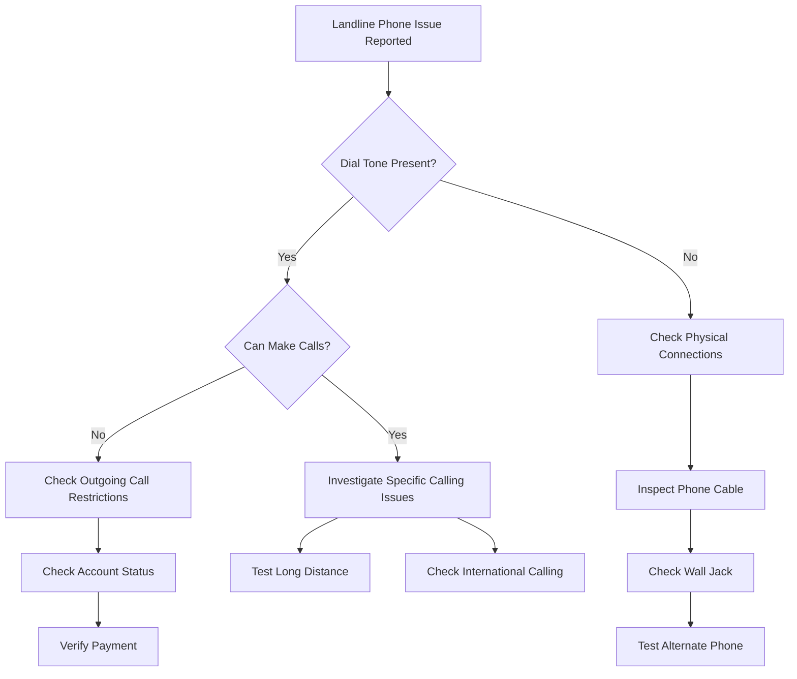

# Landline Phone Not Dialing - Troubleshooting Guide

## Overview
This guide provides step-by-step instructions to diagnose and resolve issues with landline phone service when calls cannot be made or received.

## Preliminary Checks
### Quick Diagnostic Checklist
- [ ] Check physical phone connection
- [ ] Verify dial tone
- [ ] Inspect phone cable and jacks
- [ ] Test multiple phones
- [ ] Check account status

## Troubleshooting Flowchart

## Detailed Troubleshooting Steps

### 1. Verify Dial Tone
- Pick up the handset
- Listen for a consistent dial tone
- If no dial tone:
  - Check phone cable connections
  - Verify wall jack functionality
  - Test with alternate phone

### 2. Physical Connection Troubleshooting
#### Cable Inspection
- Check for visible damage
- Ensure secure connection at:
  - Phone base
  - Wall jack
  - Telephone adapter/modem

#### Jack Testing
1. Unplug all devices
2. Connect phone directly to wall jack
3. Check for dial tone
4. If no tone, potential jack or internal wiring issue

### 3. Phone Hardware Verification
- Test multiple phones
- Swap cables
- Check for:
  - Physical damage
  - Corrosion
  - Compatibility

### 4. Service-Related Issues
#### Account Status Checks
- Verify account is active
- Check for:
  - Unpaid bills
  - Service suspensions
  - Calling restrictions

#### Calling Restriction Diagnosis
- Confirm service plan details
- Check:
  - Long-distance access
  - International calling
  - Parental controls

## Specific Scenario Troubleshooting

### No Incoming Calls
- Check ringer settings
- Verify call forwarding is disabled
- Test with phone ringer volume

### No Outgoing Calls
- Verify area code and dialing format
- Test local and long-distance calls
- Check for:
  - PIN restrictions
  - Calling plan limitations

## Advanced Diagnostic Steps
1. Factory reset phone
2. Update phone firmware
3. Contact technical support

## When to Escalate
- Persistent dial tone issues
- No resolution after following guide
- Suspected network/infrastructure problem

## Contact Information
- Technical Support: [Phone Number]
- Online Support: [Website]
- Emergency Services: 611

## Appendix
- Supported Phone Models
- Compatibility Charts
- Troubleshooting Logs

## Version Information
- Document Version: 1.2
- Last Updated: [Current Date]
- Revision Frequency: Quarterly

---

**Note:** Always prioritize customer safety and equipment integrity during troubleshooting.