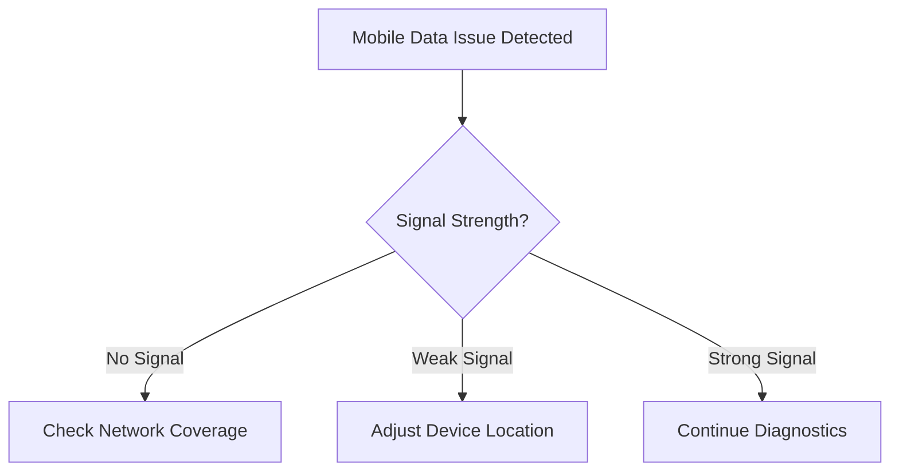

# Mobile Data Not Working - Troubleshooting Guide

## Overview
This guide provides step-by-step troubleshooting for mobile data connectivity issues across different devices and scenarios.

## Preliminary Checks
### Step 1: Basic Connectivity Verification
- [ ] Check if Airplane Mode is OFF
- [ ] Verify signal strength indicator
- [ ] Confirm active data plan on account

## Troubleshooting Decision Tree

### A. Signal and Basic Connectivity

### B. Device-Specific Diagnostics

#### iOS Devices
1. Settings > Cellular > Cellular Data
   - Toggle Cellular Data OFF and ON
   - Verify APN settings

#### Android Devices
1. Settings > Network & Internet > Mobile Network
   - Check "Mobile Data" toggle
   - Verify Access Point Name (APN)

### C. Network Settings Reset Procedure
1. Restart smartphone
2. Remove and reinsert SIM card
3. Reset network settings

## Troubleshooting Workflow

### Step 1: Connectivity Confirmation
- [ ] Check signal bars
- [ ] Verify Airplane Mode is disabled
- [ ] Confirm active data plan

### Step 2: Basic Troubleshooting
- [ ] Restart device
- [ ] Toggle Mobile Data OFF/ON
- [ ] Check for carrier service interruptions

### Step 3: Advanced Diagnostics
- [ ] Verify APN settings
- [ ] Check roaming capabilities
- [ ] Update carrier settings

## Common Error Scenarios

### Scenario 1: No Data Connection
- Possible Causes:
  - Incorrect APN settings
  - Billing/Account issues
  - Network outage

### Scenario 2: Slow Data Speeds
- Possible Causes:
  - Network congestion
  - Limited coverage area
  - Plan throttling

## Recommended Actions by Device Type

### iPhone
1. Settings > Cellular > Cellular Data Options
   - Enable/Disable LTE
   - Reset Network Settings

### Android
1. Settings > Connections > Mobile Network
   - Select Network Operators
   - Reset Network Settings

## When to Contact Support
- Persistent connection issues after troubleshooting
- Error messages indicating SIM or account problems
- Unexplained data service interruptions

## Diagnostic Codes
- APN Configuration Errors
- Network Registration Failures
- SIM Card Detection Issues

## Appendix: Troubleshooting Codes
| Code | Description | Recommended Action |
|------|-------------|-------------------|
| NR001 | No Network Registration | Check SIM, Restart Device |
| DC002 | Data Connection Failure | Verify APN Settings |
| SIM003 | SIM Card Error | Reinsert or Replace SIM |

## Support Escalation
If issues persist after following this guide:
1. Gather diagnostic information
2. Note error codes
3. Contact technical support with detailed information

---

**Note**: This guide covers general troubleshooting. Specific device or carrier variations may require additional steps.