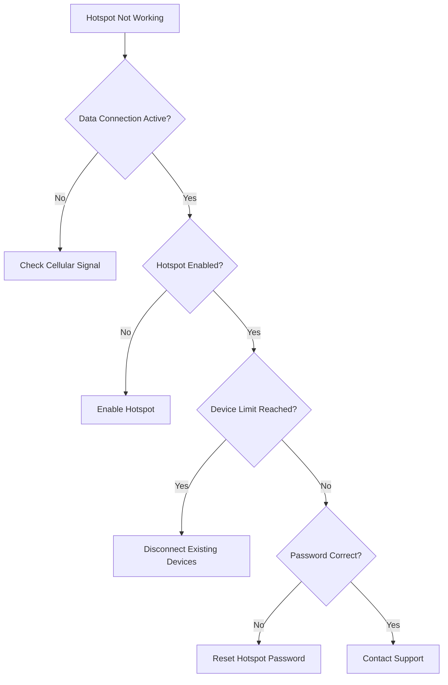

# Mobile Hotspot Setup - Technical Support Runbook

## Overview
This runbook provides comprehensive instructions for setting up and troubleshooting mobile hotspot functionality across different devices and operating systems.

## Prerequisite Checks
### Account Verification
- Ensure mobile data plan supports hotspot feature
- Verify active data plan with sufficient data allocation
- Check for any account restrictions on hotspot usage

### Device Compatibility
1. Supported Operating Systems
   - Android (6.0+)
   - iOS (12.0+)
   - iPadOS (13.0+)

2. Minimum Hardware Requirements
   - Smartphone with cellular data capability
   - Updated operating system
   - Sufficient battery charge (recommended 50%+)

## Hotspot Setup Workflow

### Android Devices
1. Navigate to Settings
2. Tap "Network & Internet"
3. Select "Hotspot & Tethering"
4. Toggle "Wi-Fi Hotspot" on
5. Configure hotspot name and password

### iOS Devices
1. Go to Settings
2. Select "Personal Hotspot"
3. Toggle "Allow Others to Join"
4. Set Wi-Fi password
5. Choose connection method (Wi-Fi/Bluetooth/USB)

## Troubleshooting Decision Tree

### Connection Issues Flowchart

## Common Troubleshooting Scenarios

### Scenario 1: No Devices Can Connect
- Verify hotspot is enabled
- Check password settings
- Restart mobile device
- Confirm data plan supports hotspot

### Scenario 2: Slow Connection
1. Check cellular signal strength
2. Verify number of connected devices
3. Confirm available data plan bandwidth
4. Restart mobile device
5. Reset network settings

### Scenario 3: Intermittent Connection
- Update device operating system
- Check for carrier network issues
- Verify battery saving modes are disabled
- Reset network settings

## Security Recommendations
- Use strong, unique hotspot password
- Limit number of connected devices
- Disable hotspot when not in use
- Regularly update device software

## Data Usage Monitoring
- Track hotspot data consumption
- Set data alerts/limits
- Understand potential overage charges

## Carrier-Specific Considerations
- Check specific carrier hotspot policies
- Verify data plan inclusions
- Understand potential additional charges

## Technical Support Escalation
If issues persist after following troubleshooting steps:
1. Gather device information
2. Note error messages
3. Prepare account details
4. Contact customer support

## Appendix: Supported Devices
- List of confirmed compatible devices
- Firmware version compatibility
- Known limitations

## Version Control
- Document Version: 1.0
- Last Updated: [Current Date]
- Review Cycle: Quarterly

## Legal Disclaimer
- Hotspot usage subject to carrier terms
- Data charges may apply
- Performance may vary by location and network conditions

---

### Quick Reference Guide
- **Activation**: Settings > Network > Hotspot
- **Password**: Minimum 8 characters, mix of letters/numbers
- **Devices Supported**: Typically 5-10 devices
- **Recommended Data Plan**: Unlimited or high-capacity plans