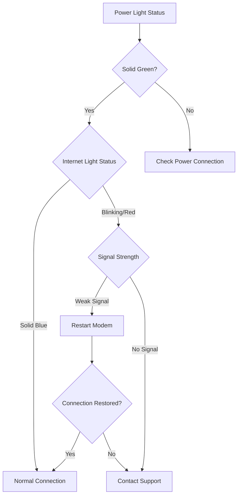

# Modem Lights Indicators - Troubleshooting Guide

## Overview
This guide helps customers understand modem light indicators and diagnose connectivity issues based on their current modem status.

## Light Indicator Reference

### Power Light (Green)
- **Solid Green**: Normal operation
- **Blinking Green**: Device booting
- **No Light**: Power issue
  - ✅ Check power cable connection
  - ✅ Try different power outlet
  - ✅ Test power adapter

### Internet/WAN Light (Blue/White)
- **Solid Blue/White**: Active Internet Connection
- **Blinking Blue/White**: Data transmission in progress
- **Red/No Light**: Connection Problem

### Troubleshooting Decision Tree

### Specific Scenario Troubleshooting

#### Scenario 1: No Internet Light
1. Verify cable connections
2. Restart modem
3. Check account status
4. Contact support if unresolved

#### Scenario 2: Intermittent Connection
1. Check for signal interference
2. Reposition modem
3. Update modem firmware
4. Run speed test

## Recommended Actions

### Basic Troubleshooting Steps
- Unplug modem for 30 seconds
- Reconnect all cables
- Verify cable connections
- Restart router/modem

### Advanced Troubleshooting
- Check account status online
- Verify billing payment
- Run diagnostic tools
- Contact technical support

## Supported Modem Types
- DOCSIS 3.0 Modems
- DOCSIS 3.1 Modems
- Fiber Optic Modems
- DSL Modems

## Error Code Reference
| Error Code | Meaning | Recommended Action |
|-----------|---------|-------------------|
| E01 | No Signal | Check cable connection |
| E02 | Authentication Failed | Verify account credentials |
| E03 | IP Configuration Error | Restart modem |

## Support Channels
- Phone Support: 1-800-HELPDESK
- Live Chat: www.example.com/support
- Email: support@example.com

## Disclaimer
⚠️ If issues persist after following these steps, professional technical support is recommended.

---

**Last Updated**: [Current Date]
**Version**: 1.2