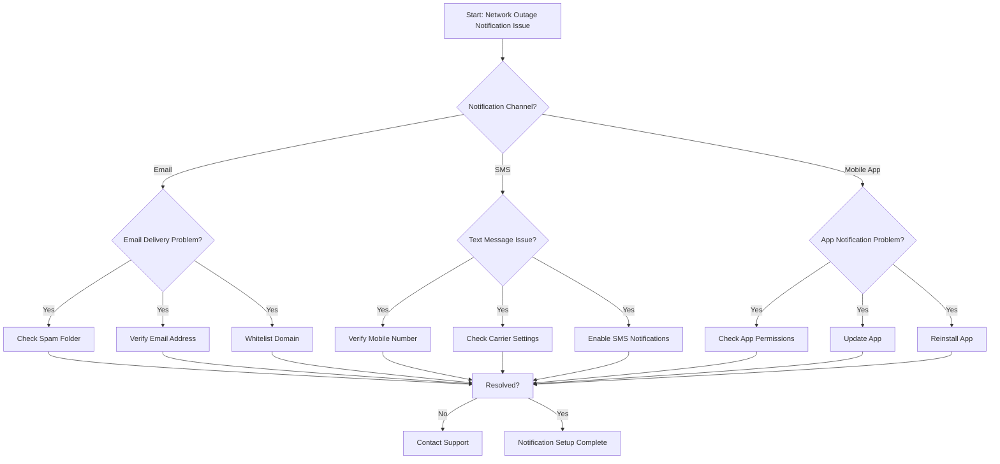

# Network Outage Notifications - Customer Self-Service Guide

## Table of Contents
1. [Introduction](#introduction)
2. [Notification Channels](#notification-channels)
3. [Setting Up Notifications](#setting-up-notifications)
4. [Troubleshooting Notification Issues](#troubleshooting-notification-issues)
5. [Decision Tree](#decision-tree)

## Introduction
This guide will help you set up and manage network outage notifications to stay informed about service disruptions in your area.

## Notification Channels
Our service offers multiple ways to receive network outage notifications:

### Primary Channels
- Email
- SMS/Text Message
- Mobile App Notifications
- Web Portal Alerts
- Phone Automated System

## Setting Up Notifications

### Online Portal Setup
1. Log in to your account at www.ourispportal.com
2. Navigate to "Notification Preferences"
3. Select desired notification channels
4. Verify contact information
5. Save preferences

### Mobile App Setup
1. Download our official mobile app
2. Log in with account credentials
3. Go to "Settings"
4. Select "Outage Notifications"
5. Choose notification methods

### Phone Setup
1. Call customer support at 1-800-OURISPHELP
2. Request notification configuration
3. Verify contact details
4. Confirm preferred notification methods

## Troubleshooting Notification Issues

### Common Problems & Solutions

#### Email Notifications Not Received
1. Check spam/junk folder
2. Verify email address in account settings
3. Whitelist our domain (support@ourispnotifications.com)
4. Check email server settings

#### SMS/Text Alerts Not Working
1. Confirm mobile number is correct
2. Ensure SMS notifications are enabled
3. Check phone's message settings
4. Verify carrier supports short codes

#### Mobile App Notifications Disabled
1. Check device notification settings
2. Ensure app has notification permissions
3. Update mobile app to latest version
4. Reinstall app if necessary

## Decision Tree

## Support Escalation
If you cannot resolve the issue using this guide:
- Call: 1-800-OURISPHELP
- Email: support@ourisphelp.com
- Live Chat: Available 24/7 on our website

## Additional Resources
- [Outage Map](https://www.ourispwebsite.com/outages)
- [Status Page](https://status.ourispwebsite.com)
- [FAQ Section](https://www.ourispwebsite.com/faq)

---

**Last Updated:** [Current Date]
**Version:** 2.1