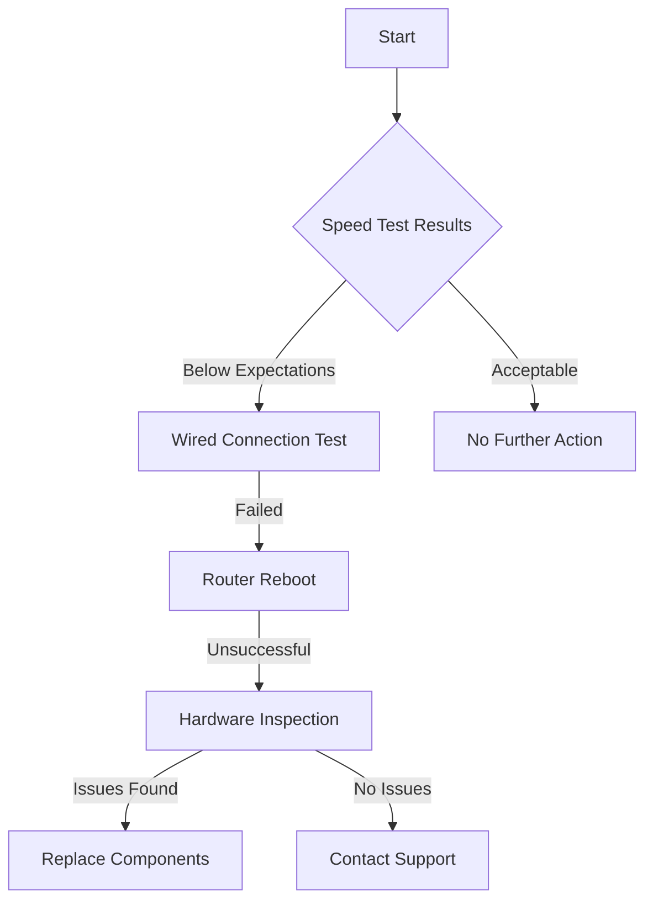

# Network Performance Optimization Guide

## Overview
This comprehensive guide provides step-by-step troubleshooting and optimization techniques to improve your network speed, reliability, and overall performance.

## Table of Contents
1. [Initial Diagnostic Checks](#initial-diagnostic-checks)
2. [Wired Connection Optimization](#wired-connection-optimization)
3. [Wireless Network Troubleshooting](#wireless-network-troubleshooting)
4. [Router and Modem Configuration](#router-and-modem-configuration)
5. [Device-Specific Optimization](#device-specific-optimization)
6. [Advanced Troubleshooting](#advanced-troubleshooting)

## Initial Diagnostic Checks
### Speed Test Procedure
1. Close unnecessary applications and background processes
2. Connect directly to modem via ethernet cable
3. Visit approved speed test websites:
   - Speedtest.net
   - Fast.com
   - Our ISP Speed Test Portal

#### Interpreting Results
- If speed is within 80-90% of subscribed plan: Acceptable
- If speed is below 70% of subscribed plan: Proceed to troubleshooting

### Network Connectivity Verification
```
Windows:
- Open Command Prompt
- Run: ping 8.8.8.8
- Check for packet loss and response times

Mac/Linux:
- Open Terminal
- Run: ping 1.1.1.1
- Verify consistent responses
```

## Wired Connection Optimization
### Ethernet Cable Checklist
- Inspect cable for physical damage
- Ensure secure connection at both ends
- Use Cat 5e or Cat 6 cables for optimal performance
- Replace cable if over 5 years old

### Cable Connection Steps
1. Disconnect and reconnect ethernet cable
2. Try alternative ethernet port on router
3. Test with known working cable

## Wireless Network Troubleshooting
### Wi-Fi Performance Optimization
#### Signal Strength Assessment
- Move closer to router
- Minimize physical obstructions
- Check Wi-Fi channel congestion
- Consider 5GHz band for less interference

#### Router Placement Guidelines
- Central location in home
- Elevated position
- Away from metal objects
- Clear of electronic interference

### Channel Selection
1. Use Wi-Fi analyzer apps
2. Identify least congested channels
3. Manually set router to optimal channel
   - 2.4GHz: Channels 1, 6, 11
   - 5GHz: Channels 36, 40, 44, 48

## Router and Modem Configuration
### Firmware Update Process
1. Access router admin panel
2. Navigate to firmware section
3. Check for available updates
4. Download and install updates
5. Reboot router after update

### Configuration Optimization
- Disable unnecessary services
- Enable QoS (Quality of Service)
- Set appropriate MTU settings
- Update security protocols

## Device-Specific Optimization
### Operating System Tweaks
#### Windows
- Disable bandwidth-consuming apps
- Update network drivers
- Adjust network adapter settings

#### macOS
- Reset network settings
- Clear DNS cache
- Update network configurations

#### Mobile Devices
- Toggle airplane mode
- Forget and reconnect to network
- Update device firmware

## Advanced Troubleshooting
### Network Diagnostic Flowchart


### Escalation Paths
1. Basic Self-Troubleshooting
2. Advanced Diagnostic Tools
3. Technical Support Ticket

## Recommended Tools
- NetSpot (Wi-Fi Analysis)
- Wireshark (Network Monitoring)
- PingPlotter (Latency Tracking)

## Contact Support
If problems persist after following this guide:
- Phone: 1-800-NETWORK
- Online Chat: Support Portal
- Email: technical.support@isp.com

---

**Note:** This guide is a living document. Always refer to the most recent version on our support website.