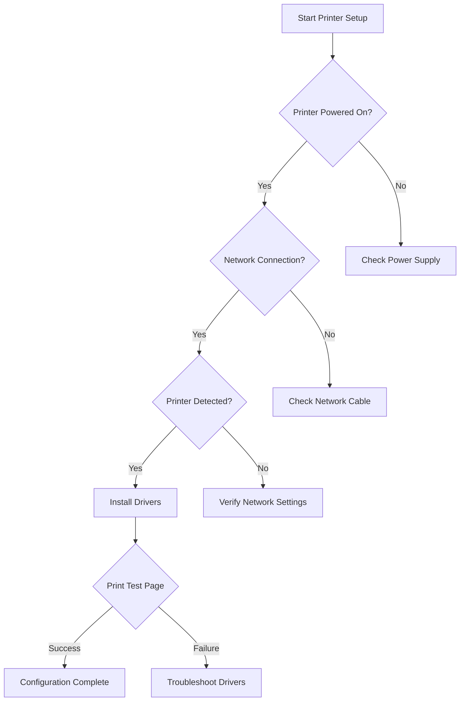

# Network Printer Setup - Runbook for ISP Network Printer Configuration

## Table of Contents
1. [Initial Setup](#initial-setup)
2. [Connection Troubleshooting](#connection-troubleshooting)
3. [Operating System Specific Instructions](#operating-system-specific-instructions)
4. [Network Configuration](#network-configuration)
5. [Troubleshooting Flowchart](#troubleshooting-flowchart)

## Initial Setup

### Prerequisites
- Functioning network connection
- Printer IP address or hostname
- Network credentials (if required)
- Compatible device (computer/laptop/mobile)

### Basic Connection Steps
1. Ensure printer is powered on
2. Verify network cable is securely connected
3. Confirm printer is connected to the same network as your device

## Connection Troubleshooting

### Common Connection Issues
- Printer not detected
- Unable to establish network connection
- Print job failures
- Limited connectivity

### Diagnostic Checklist
- [ ] Verify physical network connections
- [ ] Check network router settings
- [ ] Confirm printer IP configuration
- [ ] Test network connectivity
- [ ] Validate printer driver installation

## Operating System Specific Instructions

### Windows
#### Setup Process
1. Open Settings > Devices > Printers & Scanners
2. Click "Add a Printer or Scanner"
3. Select network printer
4. Follow on-screen installation wizard

#### Troubleshooting
- Restart print spooler service
- Reinstall printer drivers
- Verify Windows firewall settings

### macOS
#### Setup Process
1. Open System Preferences > Printers & Scanners
2. Click "+" to add new printer
3. Select network printer from list
4. Complete driver installation

#### Troubleshooting
- Reset printer permissions
- Clear print queue
- Update macOS printer drivers

### Linux
#### Setup Process
1. Open CUPS web interface
2. Add new printer
3. Select network printer
4. Install appropriate drivers

#### Troubleshooting
- Verify CUPS service
- Check network printer permissions
- Validate driver compatibility

## Network Configuration

### IP Address Configuration
- Static IP recommended
- DHCP reservation suggested
- Firewall port exceptions:
  - Port 631 (IPP)
  - Port 9100 (Raw printing)
  - Port 515 (LPR)

### Security Considerations
- Use WPA2/WPA3 encryption
- Enable printer authentication
- Regularly update firmware
- Disable unnecessary network services

## Troubleshooting Flowchart

## Escalation Paths

### When to Contact Support
- Persistent connection issues
- Driver compatibility problems
- Network configuration complexities
- Hardware malfunction suspected

## Additional Resources
- Manufacturer support website
- Driver download center
- Network configuration guides

## Version Control
- Version: 1.0
- Last Updated: [Current Date]
- Revision History: Available upon request

---

**Note:** This runbook provides general guidance. Specific printer models may require unique configuration steps.