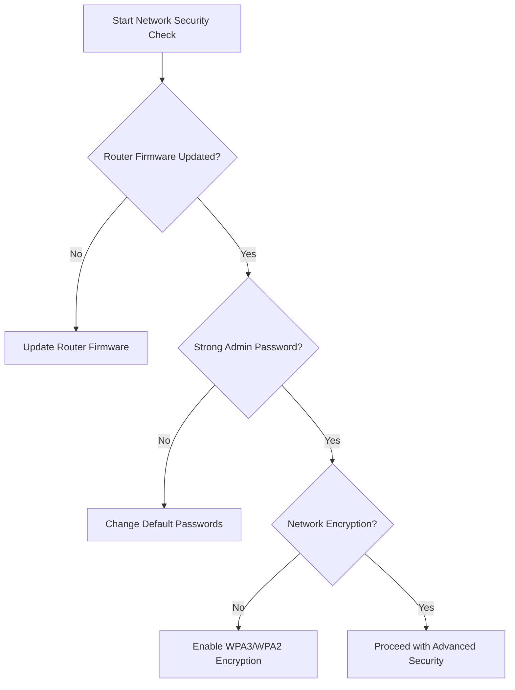
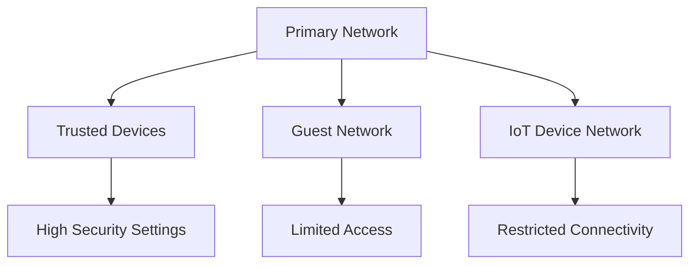
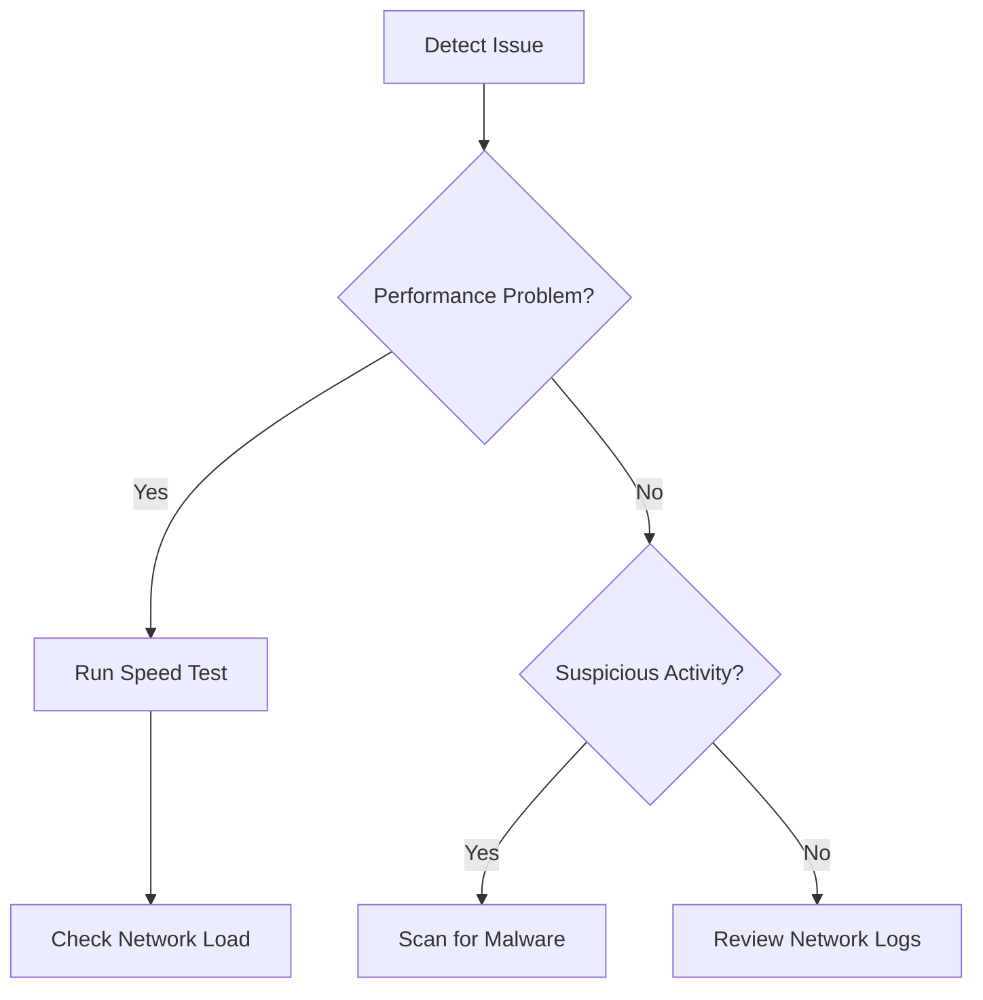

# Network Security Best Practices Runbook

## Overview
This runbook provides comprehensive guidance for securing home networks and connected devices, helping customers protect their digital environment from potential security threats.

## Table of Contents
1. [Initial Network Assessment](#initial-network-assessment)
2. [Router Security](#router-security)
3. [Device Protection](#device-protection)
4. [Network Configuration](#network-configuration)
5. [Ongoing Security Maintenance](#ongoing-security-maintenance)

## Initial Network Assessment

### Network Vulnerability Checklist
- [ ] Check router age and firmware status
- [ ] Verify current network configuration
- [ ] Identify all connected devices
- [ ] Review current security settings

### Diagnostic Decision Tree

## Router Security

### Recommended Configuration Steps
1. Change default router admin credentials
2. Disable remote management
3. Update router firmware regularly
4. Enable built-in firewall

### Credential Management
- Use complex passwords (min 12 characters)
- Avoid personal information
- Use password manager
- Enable two-factor authentication if available

## Device Protection

### Device Security Levels
- Basic Protection
- Advanced Protection
- Maximum Security

#### Basic Protection Checklist
- [ ] Enable system updates
- [ ] Install reputable antivirus
- [ ] Use built-in firewall
- [ ] Create standard user accounts

#### Advanced Protection
- Implement network segmentation
- Use VPN for sensitive activities
- Enable advanced firewall rules
- Regular security audits

## Network Configuration

### Recommended Network Settings
- Disable WPS (Wi-Fi Protected Setup)
- Use guest network for visitors
- Limit IoT device network access
- Configure MAC address filtering

### Network Isolation Strategy

## Ongoing Security Maintenance

### Quarterly Security Review
- Update all device firmware
- Rotate passwords
- Review connected devices
- Check for suspicious activities

### Security Alert Levels
1. Information
2. Warning
3. Critical
4. Immediate Action Required

## Troubleshooting Common Issues

### Network Performance & Security Problems
- Slow internet
- Unexpected device connections
- Suspicious network activity

#### Troubleshooting Workflow

## Emergency Response

### Immediate Actions
1. Disconnect suspicious devices
2. Change all passwords
3. Factory reset router if necessary
4. Contact ISP support

## Additional Resources
- Security tutorials
- Recommended security tools
- Software download links
- Support contact information

## Version Control
- Version: 1.2
- Last Updated: [Current Date]
- Review Cycle: Quarterly

## Disclaimer
This runbook provides general guidance. Individual network environments may require specialized configurations.

---

## Contact Support
If issues persist after following these guidelines, please contact our technical support team:
- Phone: [Support Number]
- Email: [Support Email]
- Live Chat: [Support Portal Link]