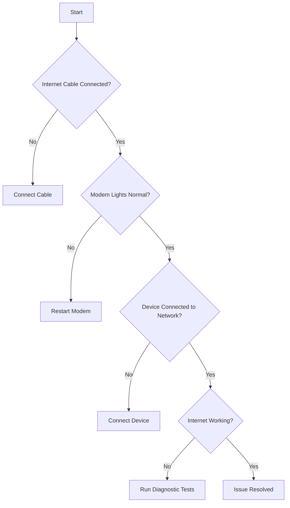
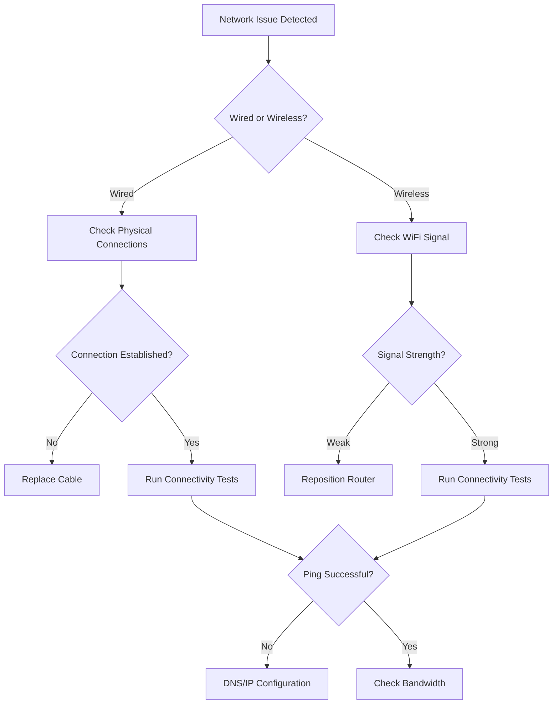

# Network Troubleshooting Tools - Guide to Diagnosing Connectivity Issues

## Table of Contents
1. [Introduction](#introduction)
2. [Preliminary Checks](#preliminary-checks)
3. [Windows Troubleshooting Tools](#windows-troubleshooting-tools)
4. [macOS Troubleshooting Tools](#macos-troubleshooting-tools)
5. [Linux Troubleshooting Tools](#linux-troubleshooting-tools)
6. [Mobile Device Troubleshooting](#mobile-device-troubleshooting)
7. [Advanced Troubleshooting](#advanced-troubleshooting)

## Introduction

This guide provides step-by-step instructions for diagnosing and resolving network connectivity issues using built-in system tools and common network diagnostic commands.

## Preliminary Checks

### Before You Begin
- Ensure all cables are securely connected
- Restart your modem and router
- Check for any service outages on our status page

### Quick Connectivity Test Decision Tree



## Windows Troubleshooting Tools

### Basic Connectivity Commands

1. **Ping Test**
   ```
   ping 8.8.8.8
   ```
   - Checks basic internet connectivity
   - Successful response indicates network is functioning

2. **Tracert Command**
   ```
   tracert www.google.com
   ```
   - Traces route to destination
   - Identifies where network interruption occurs

3. **Ipconfig Command**
   ```
   ipconfig /all
   ```
   - Displays network configuration details
   - Verifies IP address assignment

### Troubleshooting Steps

#### IP Configuration Issues
1. Release current IP
   ```
   ipconfig /release
   ```

2. Renew IP
   ```
   ipconfig /renew
   ```

3. Flush DNS Cache
   ```
   ipconfig /flushdns
   ```

## macOS Troubleshooting Tools

### Network Diagnostic Commands

1. **Ping Test**
   ```
   ping -c 5 8.8.8.8
   ```

2. **Traceroute**
   ```
   traceroute www.google.com
   ```

3. **Network Utility**
   - Open Network Utility
   - Use 'Ping' and 'Traceroute' tabs

### Troubleshooting Steps
1. Network Diagnostics
   ```
   Apple Menu > System Preferences > Network
   ```

2. Renew DHCP Lease
   ```
   sudo ipconfig set en0 DHCP
   ```

## Linux Troubleshooting Tools

### Network Diagnostic Commands

1. **Ping**
   ```
   ping -c 4 8.8.8.8
   ```

2. **Traceroute**
   ```
   traceroute www.google.com
   ```

3. **Network Status**
   ```
   ip addr show
   ```

### Troubleshooting Steps
1. Restart Network Service
   ```
   sudo systemctl restart NetworkManager
   ```

2. Renew IP
   ```
   sudo dhclient -r
   sudo dhclient
   ```

## Mobile Device Troubleshooting

### iOS
1. Toggle Airplane Mode
2. Forget and Rejoin WiFi Network
3. Reset Network Settings

### Android
1. Toggle WiFi Off/On
2. Forget and Reconnect Network
3. Reset Network Settings

## Advanced Troubleshooting

### When to Escalate
- Consistent packet loss > 10%
- Slow speeds persist after basic troubleshooting
- No connectivity after all self-service steps

### Contact Support
- Prepare diagnostic information
- Note error messages
- Have account information ready

## Recommended Tools

1. Speed Test Websites
   - Speedtest.net
   - Fast.com
   - Google Speed Test

2. Network Monitoring Apps
   - Wireshark
   - NetSpot
   - Network Analyzer

## Troubleshooting Flowchart



## Disclaimer
- These steps are general guidelines
- Individual network environments may vary
- Contact support for persistent issues

---

**Last Updated:** [Current Date]
**Version:** 1.2.0