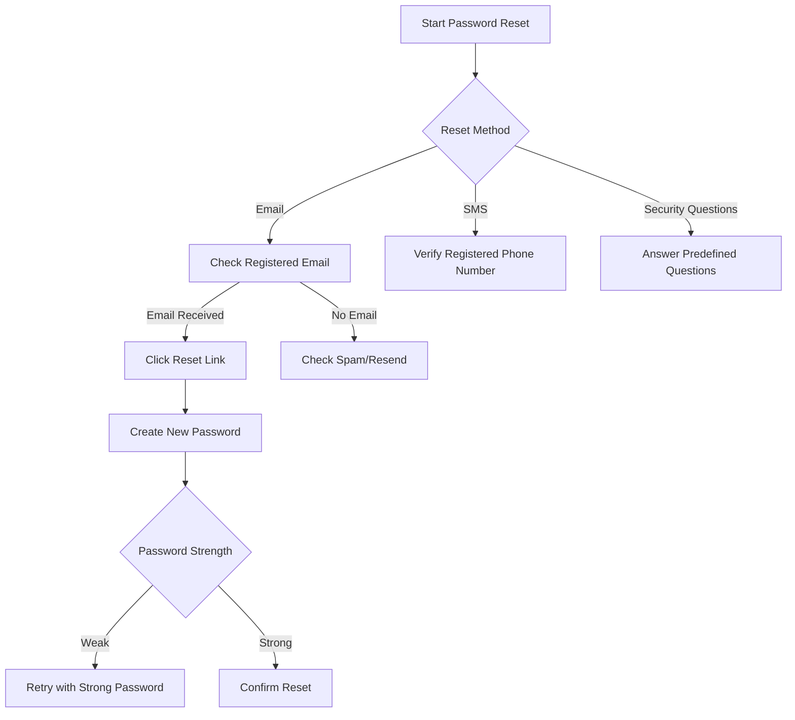

# Password Reset Procedures - Steps for Customers to Reset Account Passwords Securely

## Overview
This runbook provides comprehensive guidance for customers experiencing password-related issues across multiple platforms and account types.

## Preliminary Checks
- Ensure stable internet connection
- Have account username/email ready
- Verify you are on an official company website or authorized password reset portal

## Password Reset Decision Tree

### Option 1: Web-Based Password Reset

### Detailed Reset Procedures

#### Web Reset Steps
1. Navigate to account login page
2. Click "Forgot Password"
3. Select reset method:
   - Email verification
   - SMS code
   - Security questions
4. Follow on-screen instructions
5. Create new password meeting requirements:
   - Minimum 12 characters
   - Mix of uppercase/lowercase
   - Include numbers and symbols
6. Confirm password change

#### Mobile App Reset
1. Open mobile app
2. Select "Reset Password"
3. Choose verification method
4. Complete authentication
5. Set new password

#### Two-Factor Authentication (2FA) Reset
- Additional identity verification required
- May involve:
  - Backup codes
  - Alternate email
  - Phone verification
  - Support ticket

## Troubleshooting Common Issues

### No Reset Email Received
- Check spam/junk folder
- Verify email address on account
- Request new reset link
- Whitelist support email domain

### Account Lockout Prevention
- Maximum 5 reset attempts per 24 hours
- Wait 15 minutes between attempts
- Contact support if persistent issues

## Security Best Practices
- Never share passwords
- Use unique passwords for each account
- Enable two-factor authentication
- Use password manager
- Regularly update passwords

## Support Escalation
If self-service reset fails:
1. Gather account information
2. Prepare identification documents
3. Contact customer support
   - Phone: 1-800-HELPDESK
   - Email: support@company.com
   - Live Chat: Website Support Portal

## Technical Requirements
- Supported Browsers: 
  - Chrome (v90+)
  - Firefox (v88+)
  - Safari (v14+)
  - Edge (v90+)
- Minimum Browser Security: TLS 1.2+

## Version Control
- Document Version: 2.1
- Last Updated: 2023-11-15
- Revision Schedule: Quarterly

## Legal Disclaimer
Password reset procedures are subject to our Terms of Service. Account security is a shared responsibility.

---

**Need Further Assistance?**
- 24/7 Support Line: 1-800-HELPDESK
- Online Support Portal: support.company.com