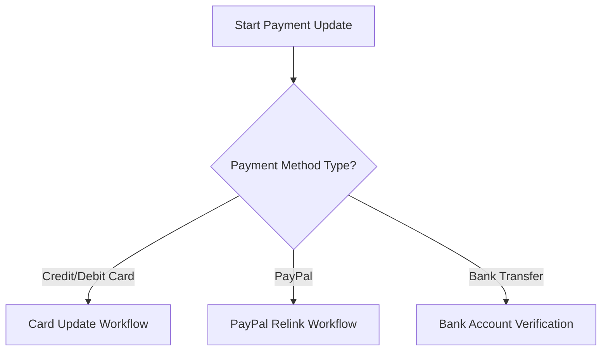

# Payment Method Updates - Instructions for Customers

## Overview
This runbook provides step-by-step guidance for updating payment methods in our billing system across multiple platforms and account types.

## Prerequisite Information
- Valid login credentials
- Current payment method details
- Access to primary email associated with account

## Supported Payment Methods
- Credit Card (Visa, Mastercard, American Express)
- Debit Card
- PayPal
- Bank Transfer/ACH
- Online Banking

## Troubleshooting Decision Tree

### 1. Access Account Billing Portal

#### Web Browser Method
1. Navigate to [ISP Website]
2. Click "Login" 
3. Enter username/email
4. Enter password
5. Select "Billing" or "Payment Methods" section

#### Mobile App Method
1. Open [ISP Mobile App]
2. Log in with credentials
3. Tap "Account" 
4. Select "Payment Methods"

### 2. Identify Payment Update Scenario

### 3. Specific Workflows

#### Credit/Debit Card Update
1. Click "Add New Card"
2. Enter card details
   - Card Number
   - Expiration Date
   - CVV
   - Billing Zip Code
3. Click "Verify and Save"

#### PayPal Relink
1. Select "PayPal" option
2. Click "Reconnect Account"
3. Follow PayPal authentication steps
4. Confirm permissions

#### Bank Transfer Update
1. Select "Bank Account"
2. Choose "Add New Account"
3. Enter:
   - Bank Name
   - Routing Number
   - Account Number
   - Account Type (Checking/Savings)
4. Complete micro-deposit verification

## Common Error Scenarios

### Card Declined
- Verify card details
- Check card expiration
- Contact bank for authorization
- Ensure sufficient funds

### Authentication Failures
- Reset password
- Clear browser cache
- Use incognito/private browsing
- Try alternate device

### System-Level Issues
- Check system status page
- Wait 30 minutes
- Contact customer support

## Troubleshooting Checklist

- [ ] Confirm current payment method
- [ ] Validate account credentials
- [ ] Ensure stable internet connection
- [ ] Check card/bank account validity
- [ ] Verify account standing

## Support Escalation

If unable to update payment method:
1. Collect error messages
2. Note attempted steps
3. Contact support:
   - Phone: 1-800-XXX-XXXX
   - Email: support@isp.com
   - Live Chat: Available 24/7

## Security Recommendations
- Use secure, private network
- Enable two-factor authentication
- Regularly monitor account activity
- Use strong, unique passwords

## Version Information
- Document Version: 1.2
- Last Updated: [Current Date]
- Revision Frequency: Quarterly

---

### Disclaimer
Payment method updates are subject to account verification and company policies. Some restrictions may apply.