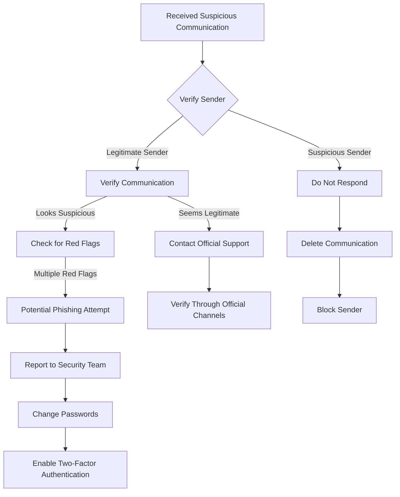

# ISP Helpdesk Runbook: Phishing Scam Awareness and Prevention

## Table of Contents
1. [Introduction](#introduction)
2. [Identifying Phishing Attempts](#identifying-phishing-attempts)
3. [Common Phishing Tactics](#common-phishing-tactics)
4. [Protective Measures](#protective-measures)
5. [What to Do If Compromised](#what-to-do-if-compromised)
6. [Troubleshooting Decision Tree](#troubleshooting-decision-tree)

## Introduction

### Purpose
This runbook provides comprehensive guidance for identifying, preventing, and responding to phishing scams targeting our internet service customers.

### Scope
Applicable to all customers using our internet services across multiple platforms and devices.

## Identifying Phishing Attempts

### Red Flags to Watch For:
- Urgent or threatening language
- Requests for personal information
- Suspicious email addresses or domains
- Unexpected attachments
- Links that don't match the supposed sender's official website

### Example Phishing Scenarios:
1. Fake account suspension emails
2. Fraudulent password reset requests
3. Bogus security alert notifications
4. Fake billing communication

## Common Phishing Tactics

### Email Phishing Techniques
- Spoofed sender addresses
- Impersonation of official company communications
- Urgent calls to action
- Malicious attachments
- Deceptive hyperlinks

### Social Engineering Methods
- Psychological manipulation
- Creating a sense of urgency
- Exploiting fear or curiosity
- Mimicking legitimate communication styles

## Protective Measures

### Email Safety
- Never click on unsolicited links
- Verify sender authenticity
- Check email domain carefully
- Hover over links to preview destination
- Use email filtering tools

### Account Protection
- Enable two-factor authentication
- Use strong, unique passwords
- Regularly update account credentials
- Monitor account activity
- Use password management tools

### Technical Safeguards
- Keep software updated
- Use reputable antivirus software
- Enable spam filters
- Use browser security extensions

## What to Do If Compromised

### Immediate Actions
1. Disconnect from the internet
2. Change all account passwords
3. Contact our support team
4. Report the incident
5. Monitor financial statements

### Reporting Procedure
- Call our dedicated security hotline: 1-800-SECURITY
- Email: security@ourcompany.com
- Use online reporting portal

## Troubleshooting Decision Tree

## Additional Resources
- Official Phishing Prevention Guide
- Security Awareness Training
- Customer Support Contact Information

## Version Control
- Version: 1.2
- Last Updated: [Current Date]
- Approved By: Security Operations Team

## Disclaimer
This document is for informational purposes and may be updated periodically. Always consult official communication channels for the most current information.

---

**Pro Tip:** When in doubt, always verify through official channels before taking any action on suspicious communications.