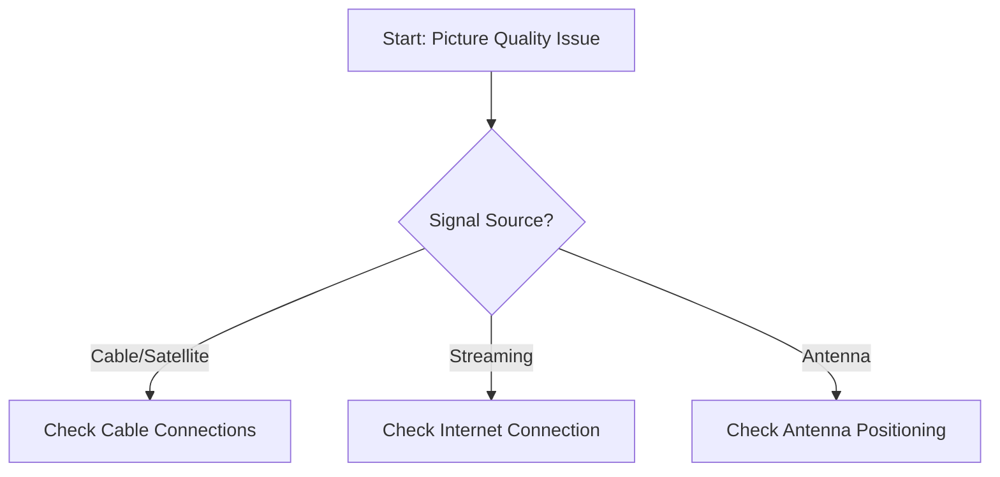
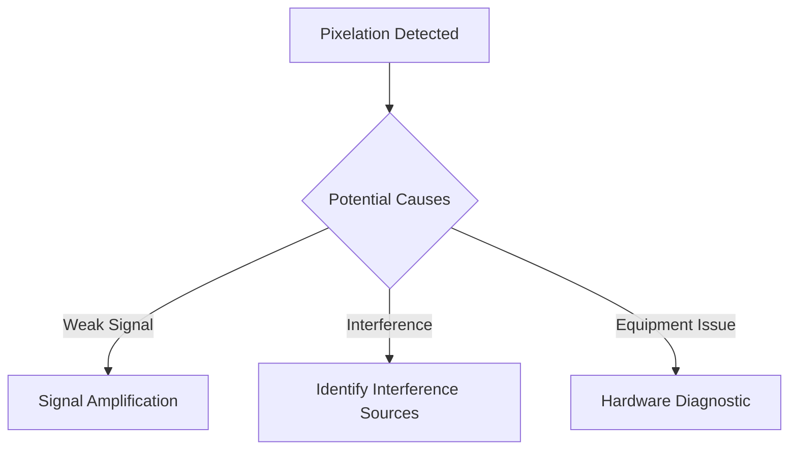
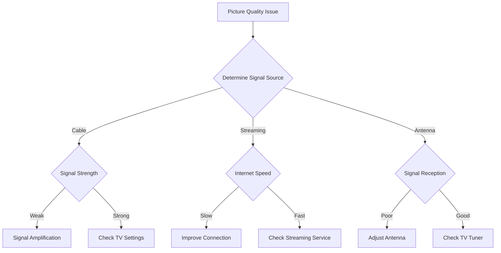

# Picture Quality Issues on TV - Troubleshooting Guide

## Overview
This guide provides step-by-step troubleshooting for customers experiencing picture quality issues, including pixelation, blurriness, or signal problems with their TV service.

## Preliminary Checks
### Initial Diagnostic Flow


## Troubleshooting Steps

### 1. Cable/Satellite Connection Troubleshooting
#### Physical Inspection
- [ ] Verify all coaxial cables are securely connected
- [ ] Check for any visible cable damage
- [ ] Ensure cable connections are not loose

#### Signal Diagnostic
1. Verify signal strength
2. Restart cable/satellite box
   ```
   Steps:
   1. Unplug power cord
   2. Wait 60 seconds
   3. Plug back in
   4. Allow 3-5 minutes for reboot
   ```

### 2. Internet-Based Issues (Streaming)
#### Connection Quality Check
- [ ] Run internet speed test
- [ ] Minimum recommended speeds:
  - SD Video: 3-4 Mbps
  - HD Video: 5-8 Mbps
  - 4K Video: 25+ Mbps

#### Troubleshooting Steps
1. Restart modem/router
2. Check Wi-Fi signal strength
3. Use wired ethernet if possible

### 3. TV Settings Verification
#### Picture Settings
- [ ] Check TV picture mode
- [ ] Verify contrast/brightness settings
- [ ] Reset to factory default picture settings

### 4. Specific Pixelation Causes


#### Signal Interference Checklist
- [ ] Move wireless devices away from TV/cable box
- [ ] Check for nearby electronic interference
- [ ] Verify splitter quality (if used)

### 5. Advanced Diagnostics

#### Signal Strength Measurement
- Acceptable signal strength: -6 to +15 dBmV
- Low signal: Below -6 dBmV
- High signal: Above +15 dBmV

### Escalation Path
If issues persist after following guide:
1. Capture error codes
2. Note troubleshooting steps performed
3. Contact technical support
4. Schedule technician visit if necessary

## Diagnostic Decision Tree


## Troubleshooting Success Rates
- Self-Resolution Rate: 75-80%
- Common Fix: Restart/Reconnect Equipment

## Customer Support Contact
- Technical Support: 1-800-HELP-TECH
- Online Support: support.isp.com
- Chat Support: Available 24/7

## Document Version
- Last Updated: [Current Date]
- Version: 2.1

---

### Documentation Notes
- Regularly update with new troubleshooting techniques
- Maintain clear, concise language
- Include visual diagrams where possible