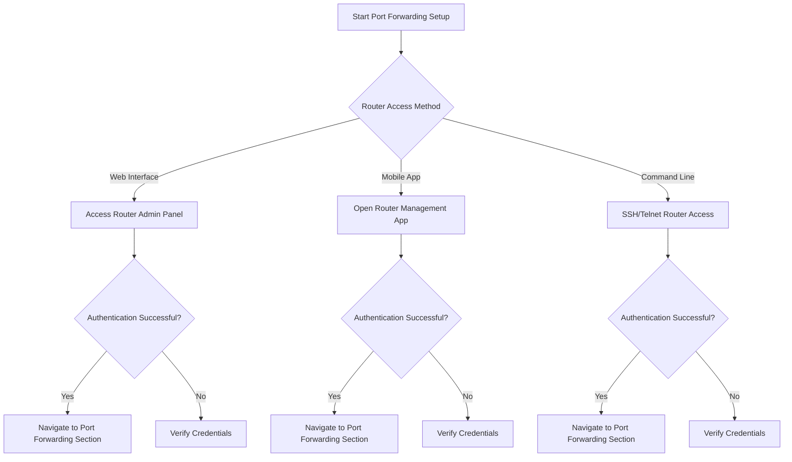

# Port Forwarding Configuration Guide

## Overview
This guide provides step-by-step instructions for configuring port forwarding on your router to enable specific applications and services to function correctly.

## Prerequisites
- Active internet connection
- Router admin credentials
- Device IP address
- Port numbers for the specific application

## Troubleshooting Decision Tree

## Detailed Configuration Steps

### 1. Access Router Administration Panel
1. Open web browser
2. Enter router IP address (typically 192.168.0.1 or 192.168.1.1)
3. Enter admin username and password

### 2. Locate Port Forwarding Section
- Common locations:
  - Advanced Settings
  - Network
  - NAT/Port Forwarding
  - Virtual Servers

### 3. Create Port Forward Rule

#### Required Information
- External Port
- Internal Port
- Protocol (TCP/UDP)
- Internal Device IP Address

### Router Configuration Examples

#### Typical Scenarios
1. Gaming Console
2. Remote Desktop
3. Web Server
4. Custom Application

#### Sample Configuration Table

| Application | External Port | Internal Port | Protocol | IP Address |
|------------|--------------|--------------|----------|------------|
| Gaming     | 3074         | 3074         | UDP/TCP  | 192.168.1.100 |
| Web Server | 80           | 80           | TCP      | 192.168.1.50  |
| SSH        | 22           | 22           | TCP      | 192.168.1.25  |

## Troubleshooting Common Issues

### Connectivity Problems
- Verify internal device IP
- Check firewall settings
- Confirm router supports port forwarding
- Restart router and device

### Security Considerations
- Use strong passwords
- Limit exposed ports
- Update router firmware regularly

## Compatibility Matrix

### Supported Router Brands
- Netgear
- Linksys
- TP-Link
- ASUS
- D-Link

### Operating System Support
- Windows 10/11
- macOS
- Linux
- iOS
- Android

## Error Codes and Resolutions

| Error Code | Description | Recommended Action |
|-----------|-------------|-------------------|
| 403       | Access Denied | Check router credentials |
| 500       | Internal Server Error | Reboot router |
| NAT Error | Network Address Translation Issue | Verify network configuration |

## Additional Resources
- Router manufacturer support
- Online port forwarding calculators
- Network configuration forums

## Version Information
- Document Version: 1.2
- Last Updated: [Current Date]
- Revision Frequency: Quarterly

## Contact Support
If unable to resolve issues:
- Phone: 1-800-HELPDESK
- Email: support@isp.com
- Live Chat: Available 24/7

---

**Disclaimer**: Configuration steps may vary slightly depending on specific router model and firmware version.