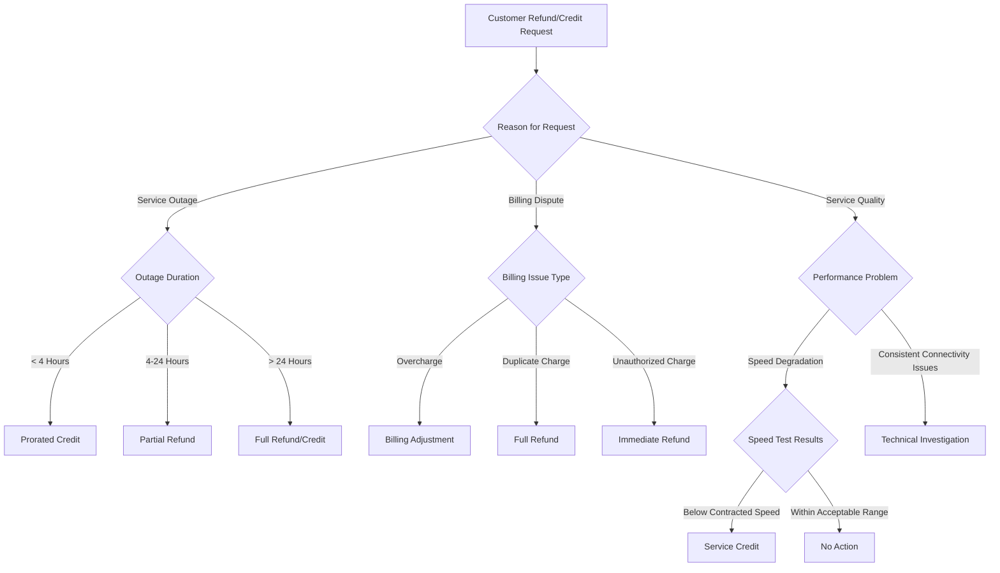

# Refund or Credit Requests - Runbook for Handling Customer Service Issues

## Overview
This runbook provides a comprehensive guide for customers seeking refunds or credits due to service-related issues.

## Decision Tree Flowchart

## Refund/Credit Eligibility Criteria

### Service Outage Refunds
1. **Outage Duration Thresholds**
   - < 4 hours: Prorated service credit
   - 4-24 hours: Partial refund (25-50% of monthly bill)
   - > 24 hours: Full monthly credit or refund

2. **Required Documentation**
   - Timestamp of outage
   - Proof of impact
   - Network status reports

### Billing Dispute Categories
1. **Overcharges**
   - Verify billing statements
   - Provide billing adjustment
   - Refund excess charges

2. **Duplicate Charges**
   - Immediate full refund
   - Investigation of billing system

3. **Unauthorized Charges**
   - Immediate refund
   - Account security review

### Service Quality Issues
1. **Speed Degradation**
   - Conduct speed test
   - Compare against contracted speeds
   - Determine credit eligibility

2. **Connectivity Problems**
   - Technical investigation
   - Potential service credit

## Submission Process

### Online Submission
1. Log into customer portal
2. Navigate to "Refund/Credit Request"
3. Select reason for request
4. Upload supporting documentation
5. Submit request

### Phone/Chat Submission
1. Provide account details
2. Explain service issue
3. Agent will verify claim
4. Process refund/credit

## Documentation Requirements
- Account number
- Date of service issue
- Detailed description
- Supporting evidence
- Contact information

## Processing Timelines
- Simple requests: 3-5 business days
- Complex investigations: Up to 15 business days
- Urgent cases: Expedited review

## Exclusions
- Scheduled maintenance
- Customer-caused issues
- Third-party service interruptions

## Appeal Process
1. Initial denial of request
2. Submit additional evidence
3. Secondary review
4. Final determination

## Contact Information
- Customer Support: 1-800-SUPPORT
- Email: support@isp.com
- Live Chat: Available 24/7

## Revision History
- Version 1.0 - Initial Release
- Last Updated: [Current Date]

## Legal Disclaimer
Refund and credit policies are subject to change. Full terms available in service agreement.