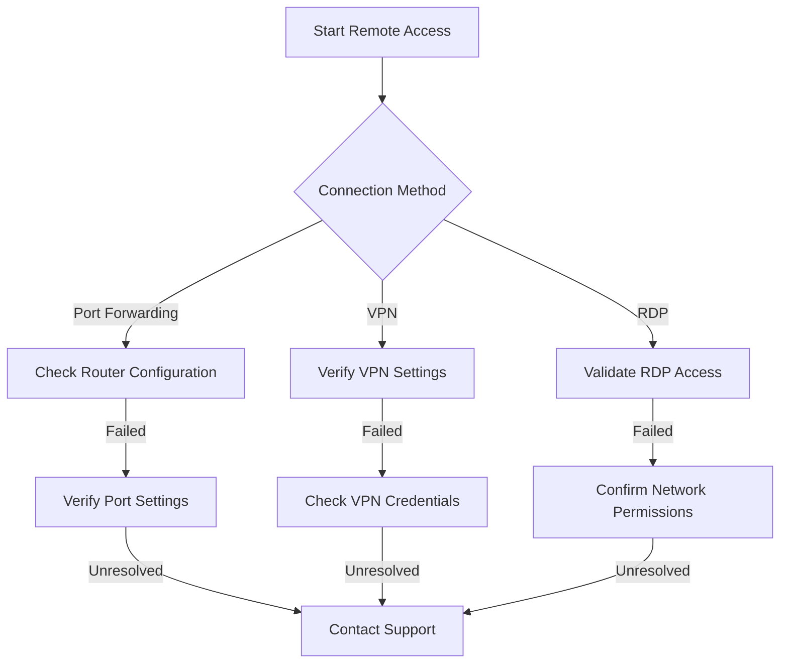

# Remote Access Setup Guide

## Overview
This runbook provides comprehensive instructions for setting up secure remote access to home networks and devices for troubleshooting, management, and monitoring purposes.

## Table of Contents
1. [Prerequisites](#prerequisites)
2. [Connection Methods](#connection-methods)
3. [Network Configuration](#network-configuration)
4. [Security Considerations](#security-considerations)
5. [Troubleshooting](#troubleshooting)

## Prerequisites
### Required Equipment
- Router with remote access capabilities
- Stable internet connection
- Device to access network remotely (computer, smartphone, tablet)
- Network credentials

### Minimum System Requirements
- Internet speed: 10 Mbps download / 5 Mbps upload
- Router firmware: Latest version
- Operating Systems Supported:
  - Windows 10/11
  - macOS 10.15+
  - iOS 14+
  - Android 10+

## Connection Methods

### Method 1: Port Forwarding
#### Steps:
1. Log into router administration panel
2. Navigate to Port Forwarding section
3. Create new port forward rule
   - External Port
   - Internal IP Address
   - Protocol (TCP/UDP)

```markdown
Example Configuration:
- External Port: 22 (SSH)
- Internal IP: 192.168.1.100
- Protocol: TCP
```

### Method 2: VPN Setup
#### Types of VPN
- PPTP
- L2TP/IPsec
- OpenVPN
- WireGuard

#### VPN Configuration Steps
1. Enable VPN service on router
2. Generate VPN credentials
3. Configure client devices
4. Establish secure connection

### Method 3: Remote Desktop Protocol (RDP)
#### Windows Configuration
1. Enable Remote Desktop in System Properties
2. Configure Windows Firewall
3. Create user access permissions

## Network Configuration

### Router Settings
- Enable remote management
- Set strong admin password
- Configure firewall rules
- Enable encryption

### Recommended Security Configurations
- Use strong, unique passwords
- Enable two-factor authentication
- Regularly update firmware
- Limit remote access IP ranges

## Security Considerations

### Best Practices
- Use VPN for encrypted connections
- Implement multi-factor authentication
- Regularly rotate access credentials
- Monitor connection logs
- Use strong encryption protocols

### Potential Risks
- Unauthorized access
- Data interception
- Brute force attacks
- Malware transmission

## Troubleshooting Flowchart



## Troubleshooting Common Issues

### Connection Failures
- Verify network credentials
- Check internet connectivity
- Confirm firewall settings
- Validate IP configurations

### Performance Issues
- Test network speed
- Reduce simultaneous connections
- Update router firmware
- Optimize bandwidth allocation

## Error Code Reference

| Error Code | Description | Recommended Action |
|-----------|-------------|-------------------|
| 401 | Unauthorized | Verify credentials |
| 403 | Forbidden | Check access permissions |
| 500 | Internal Server Error | Restart router/service |
| 502 | Bad Gateway | Check network configuration |

## Support Contact
- Technical Support: 1-800-SUPPORT
- Email: techsupport@isp.com
- Online Chat: www.isp.com/support

## Appendix
- Glossary of Technical Terms
- Recommended Equipment
- Version History

---

**Note:** This guide is a generic template and may require customization based on specific network infrastructure and ISP requirements.