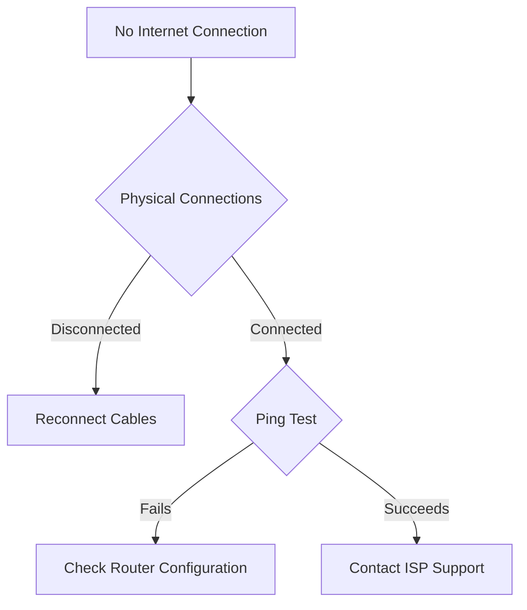

# Router Configuration Issues - Troubleshooting Runbook

## Table of Contents
1. [Introduction](#introduction)
2. [Preliminary Checks](#preliminary-checks)
3. [Connectivity Troubleshooting](#connectivity-troubleshooting)
4. [Router Configuration Diagnostics](#router-configuration-diagnostics)
5. [Advanced Troubleshooting](#advanced-troubleshooting)
6. [Specific OS Guidance](#specific-os-guidance)

## Introduction

### Purpose
This runbook provides comprehensive guidance for resolving common router configuration and connectivity issues across multiple network environments and devices.

### Scope
- Home and small business router configurations
- Supported operating systems: Windows, macOS, Linux, iOS, Android
- Applicable for most router brands (Cisco, Netgear, TP-Link, ASUS, etc.)

## Preliminary Checks

### Basic Hardware Verification
1. Ensure physical connections
   - Power cable securely connected
   - Ethernet cables properly inserted
   - Coaxial/Fiber cable connected (if applicable)

2. Router LED Status
   - Solid power light: Normal operation
   - Blinking power light: Potential power/hardware issue
   - No power light: Check power supply

### Quick Diagnostic Steps
- Restart router
- Verify cable connections
- Check internet service status via mobile network

## Connectivity Troubleshooting

### Decision Tree: Internet Connection Issues


### Troubleshooting Workflow
1. Physical Layer Checks
   - Verify all cables are securely connected
   - Test with alternate cables
   - Check cable/port for physical damage

2. Network Layer Diagnostics
   ```bash
   # Windows Command Prompt
   ping 8.8.8.8
   tracert 8.8.8.8

   # macOS/Linux Terminal
   ping 8.8.8.8
   traceroute 8.8.8.8
   ```

3. Router Configuration Verification
   - Access router admin panel
   - Check IP configuration
   - Validate DNS settings

## Router Configuration Diagnostics

### Common Configuration Issues
- Incorrect IP assignment
- DHCP server misconfiguration
- Firewall blocking connections
- Incorrect DNS settings

### Configuration Reset Procedure
1. Access router administration interface
2. Navigate to "Reset" or "Restore Defaults"
3. Perform factory reset
4. Reconfigure basic settings
   - WAN/Internet settings
   - Wireless network
   - Security protocols

## Advanced Troubleshooting

### Wireless Specific Issues
- Channel interference
- Signal strength problems
- Security protocol misconfigurations

### Network Performance Testing
- Speed test websites
- Bandwidth measurement tools
- Latency and packet loss analysis

## Specific OS Guidance

### Windows
- Network troubleshooter
- IP configuration reset
- Firewall configuration

### macOS
- Network preference reset
- Airport utility diagnostics
- System network settings

### Linux
- NetworkManager commands
- `ip` and `nmcli` utilities
- Wireless driver verification

## Escalation Procedures

### When to Contact Support
- Persistent connectivity issues
- Hardware failure suspected
- Configuration complexity exceeds self-service

### Required Information
- Router model
- Firmware version
- Specific error messages
- Troubleshooting steps already attempted

## Appendix

### Recommended Tools
- Speedtest.net
- Wireshark
- Network diagnostic utilities
- Router manufacturer support tools

### Version Information
- Document Version: 1.2
- Last Updated: [Current Date]
- Revision Frequency: Quarterly

---

**Note:** This runbook provides generalized guidance. Specific router models may require unique troubleshooting approaches.