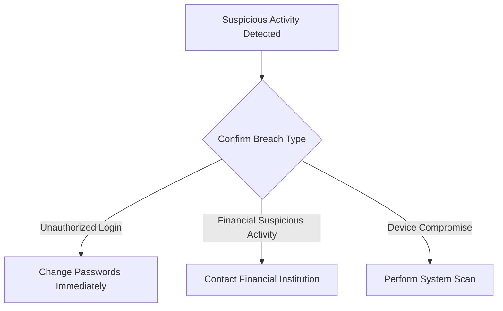

# Security Breach Response Runbook

## Purpose
This runbook provides step-by-step guidance for customers who suspect a security breach of their internet account or personal information.

## Threat Levels
- Low Risk: Suspicious activity detected
- Medium Risk: Potential unauthorized access
- High Risk: Confirmed breach or data compromise

## Initial Assessment Checklist

### Immediate Actions
1. **Disconnect from Network**
   - Unplug ethernet cable
   - Disable WiFi
   - Turn off mobile data

2. **Identify Potential Breach Indicators**
   ✓ Unexpected account activity
   ✓ Unfamiliar logins
   ✓ Strange emails or messages
   ✓ Unexplained charges
   ✓ Device performance issues

## Detailed Troubleshooting Workflow

### Decision Tree: Security Breach Assessment

### Password Reset Protocol
1. Change passwords on:
   - Internet account
   - Email
   - Financial platforms
   - Social media accounts

2. Use strong password guidelines:
   - Minimum 12 characters
   - Mix of uppercase/lowercase
   - Include numbers and symbols
   - Avoid personal information

### System Scan Procedures
#### Windows
- Open Windows Security
- Run Full Antivirus Scan
- Update Windows Defender definitions

#### Mac
- Open Apple Security
- Run full system malware scan
- Check for unknown applications

#### Mobile Devices
- Update operating system
- Run security app scan
- Remove suspicious applications

## Reporting Procedure

### Contact Information
- ISP Security Helpline: 1-800-SECURE-NET
- Fraud Reporting: securityteam@ourcompany.com
- Online Reporting Portal: www.ourcompany.com/security-report

### Required Information for Report
- Date of suspected breach
- Specific suspicious activities
- Affected accounts
- Device information
- Screenshot evidence (if possible)

## Prevention Recommendations

### Security Best Practices
1. Enable Two-Factor Authentication
2. Use Unique Passwords
3. Update Software Regularly
4. Use Reputable Security Software
5. Be Cautious of Phishing Attempts

## Escalation Matrix

### Breach Severity Levels
| Severity | Action | Response Time |
|----------|--------|---------------|
| Low | Self-Service | 24-48 Hours |
| Medium | Technical Support Ticket | 4-8 Hours |
| High | Immediate Intervention | 1-2 Hours |

## Legal and Compliance Notice
- Customers are advised to monitor credit reports
- Report potential identity theft
- Consult local law enforcement if significant financial damage occurs

## Version Control
- Document Version: 2.1
- Last Updated: [Current Date]
- Review Cycle: Quarterly

---

**Need Immediate Assistance?**
🚨 Emergency Support: 1-800-SECURE-NET
📧 Urgent Reporting: securityteam@ourcompany.com

*This document is confidential and intended for customer use only.*