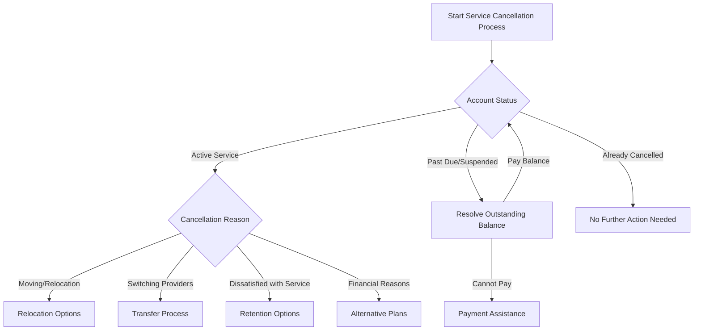

# Service Cancellation Process - Procedures for Customers

## Overview
This runbook provides comprehensive guidance for customers seeking to cancel their internet service subscription, addressing various scenarios, account types, and potential complications.

## Decision Tree for Service Cancellation

## Cancellation Procedures

### Method 1: Online Self-Service Cancellation
1. Log into your account at [ISP Website]
2. Navigate to "Account Management"
3. Select "Cancel Service"
4. Complete cancellation questionnaire
5. Confirm cancellation
6. Receive confirmation email

### Method 2: Phone Cancellation
1. Call Customer Support: 1-800-XXX-XXXX
2. Verify Account Credentials
   - Account Number
   - Billing Zip Code
   - Last 4 Digits of Payment Method
3. Speak with Representative
4. Confirm Cancellation Details

### Method 3: In-Person Cancellation
1. Visit Local Service Center
2. Bring:
   - Government-issued ID
   - Account Documentation
   - Current Billing Statement

## Cancellation Fees and Considerations

### Early Termination Fees
- Contract Length Impact
  - Less than 12 months: Full early termination fee
  - More than 12 months: Prorated fee
- Typical Fee Range: $75 - $250

### Equipment Return Requirements
- Return within 14 days of cancellation
- Original equipment only
- Complete equipment return checklist
- Return via:
  - Shipping Label
  - Local Service Center
  - Authorized Drop-off Location

## Post-Cancellation Checklist

### Financial Reconciliation
- Final Bill Issued
- Prorated Service Charges
- Equipment Fees
- Outstanding Balance Settled

### Service Transition
- Deactivation Date Confirmed
- Service Interruption Timeline
- Equipment Return Status

## Troubleshooting Common Issues

### Scenario 1: Unexpected Cancellation Fee
- Review Original Contract
- Check Contract Duration
- Verify Promotional Terms
- Contact Retention Department

### Scenario 2: Equipment Return Problems
1. Photograph Equipment
2. Get Tracking Number
3. Retain Shipping Documentation
4. Contact Support if No Confirmation

### Scenario 3: Billing Disputes
- Request Detailed Billing Statement
- Review Line Item Charges
- Initiate Formal Dispute Process
- Escalate to Billing Department

## Customer Support Escalation

### When to Escalate
- Unresolved Billing Disputes
- Complex Contract Terminations
- Technical Cancellation Barriers
- Potential Service Violations

### Escalation Contacts
- Tier 1 Support: General Inquiries
- Tier 2 Support: Technical Challenges
- Retention Department: Contract Negotiations
- Billing Specialist: Financial Reconciliation

## Important Notes
- Cancellation is FINAL
- 30-day notice typically required
- Keep all documentation
- Obtain written/email confirmation

## Recommended Next Steps
1. Confirm Cancellation Method
2. Prepare Equipment for Return
3. Settle Outstanding Balance
4. Request Cancellation Confirmation

---

**Last Updated:** [Current Date]
**Version:** 2.1
**Support Reference:** Cancellation Procedures Manual