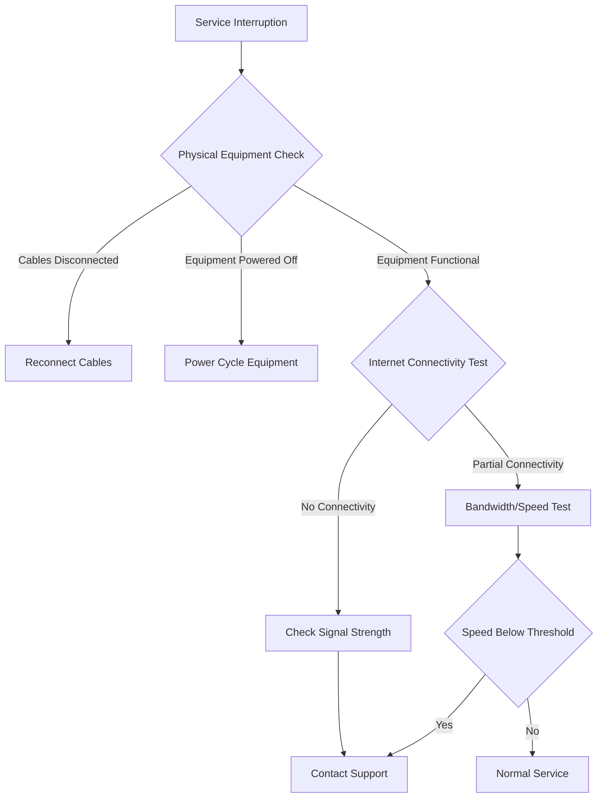

# Service Outage Reporting - Runbook for Customers

## Overview
This runbook provides step-by-step guidance for customers experiencing service interruptions or connectivity issues.

## Preliminary Diagnostics

### Step 1: Initial Connectivity Check
1. Verify physical connections
   - Ensure all cables are securely connected
   - Check modem and router power indicators
   - Restart networking equipment

2. Device-Specific Checks
   - **Windows**:
     ```
     - Open Command Prompt
     - Run: ipconfig /all
     - Run: ping 8.8.8.8
     ```
   - **Mac**:
     ```
     - Open Network Utility
     - Select Network Diagnostics
     - Run Network Connectivity Test
     ```
   - **Mobile Devices**:
     - Toggle Airplane Mode
     - Restart device
     - Check Wi-Fi/Cellular settings

## Troubleshooting Decision Tree

### Connection Status Flowchart


### Specific Troubleshooting Scenarios

#### Scenario 1: Complete Service Outage
1. Confirm outage is not localized to your device
   - Check multiple devices
   - Verify neighbors' connectivity

2. Check service status
   - Visit ISP website status page
   - Check social media channels
   - Call service status hotline

#### Scenario 2: Intermittent Connectivity
1. Run continuous ping test
   ```bash
   # Windows/Mac/Linux
   ping -t [ISP Gateway IP]
   ```

2. Document connectivity patterns
   - Time of day
   - Duration of interruptions
   - Specific applications affected

## Reporting an Outage

### Mandatory Information
- Account Number
- Service Address
- Contact Phone Number
- Detailed Description of Issue
- Troubleshooting Steps Already Attempted

### Reporting Channels
1. Online Support Portal
2. Mobile App
3. Customer Support Hotline
4. Email Support

## Escalation Procedure

### Priority Levels
1. **Critical**: Complete service outage
2. **High**: Severe performance degradation
3. **Medium**: Intermittent connectivity issues
4. **Low**: Minor service fluctuations

### Estimated Response Times
- Critical: Within 30 minutes
- High: Within 2 hours
- Medium: Within 4-6 hours
- Low: Within 24 hours

## Supplementary Diagnostics

### Network Testing Tools
- SpeedTest.net
- Fast.com
- ISP-Provided Diagnostic Tools

### Browser-Based Checks
- Clear browser cache
- Disable VPN/Proxy
- Test in incognito/private mode

## Technical Support Contact

### Support Hotline
- Tier 1 Support: 1-800-HELP-ISP
- Technical Escalation: 1-888-TECH-SUP

### Online Support
- Live Chat: www.ispdomain.com/support
- Email: techsupport@ispdomain.com

## Disclaimer
This runbook is a general guide. Individual issues may require personalized technical support.

## Version Control
- **Version**: 2.1
- **Last Updated**: [Current Date]
- **Review Cycle**: Quarterly