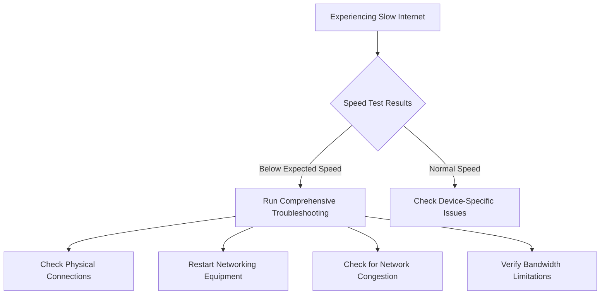

# Slow Internet Speeds - Troubleshooting Guide

## Overview
This guide provides step-by-step instructions to diagnose and resolve slow internet speed issues across various devices and network configurations.

## Quick Diagnostic Flowchart

## Preliminary Speed Test
### Recommended Speed Test Tools
- Speedtest.net
- Fast.com
- Our ISP Speed Test Portal

### Speed Test Criteria
1. Run tests on multiple devices
2. Test via Ethernet and WiFi
3. Test at different times of day
4. Compare results to subscribed plan

## Troubleshooting Workflow

### Step 1: Physical Connection Check
- [ ] Verify cable connections are secure
- [ ] Inspect ethernet/coaxial cables for damage
- [ ] Ensure modem and router are powered on
- [ ] Check indicator lights on networking equipment

### Step 2: Equipment Restart Procedure
1. Power off modem
2. Power off router
3. Wait 60 seconds
4. Power on modem
5. Wait 2 minutes
6. Power on router
7. Run speed test

### Step 3: WiFi-Specific Diagnostics
#### WiFi Optimization
- Reposition router to central location
- Minimize physical obstructions
- Change WiFi channel
- Update router firmware
- Check for WiFi interference

#### WiFi Troubleshooting Checklist
- [ ] Distance from router
- [ ] Number of connected devices
- [ ] Potential interference sources
- [ ] Router age/capabilities

### Step 4: Device-Specific Investigations

#### Windows
1. Disable bandwidth-heavy background apps
2. Update network drivers
3. Run network diagnostics
4. Clear browser cache

#### MacOS
1. Reset network settings
2. Check energy-saving network configurations
3. Verify DNS settings
4. Update operating system

#### Mobile Devices
1. Toggle airplane mode
2. Forget and reconnect to WiFi
3. Check for system updates
4. Limit background data usage

### Step 5: Advanced Troubleshooting

#### Network Configuration
- Check DNS settings
- Verify IP configuration
- Test with alternate DNS (8.8.8.8)

#### Bandwidth Management
- Identify bandwidth-consuming applications
- Implement Quality of Service (QoS) rules
- Schedule large downloads during off-peak hours

## Escalation Paths

### When to Contact Support
- Persistent speed issues after troubleshooting
- Consistent speeds significantly below plan
- Physical line/infrastructure problems suspected
- Equipment malfunction

### Required Information for Support
- Account number
- Specific speed test results
- Devices tested
- Troubleshooting steps already attempted

## Technical Reference
### Typical Household Bandwidth Requirements
- Web browsing: 1-5 Mbps
- HD Streaming: 5-25 Mbps
- 4K Streaming: 25-100 Mbps
- Online Gaming: 10-50 Mbps
- Video Conferencing: 10-25 Mbps

## Disclaimer
Actual performance may vary based on network conditions, equipment, and subscribed plan.

---

## Version Information
- Document Version: 1.2
- Last Updated: [Current Date]
- Approved By: Technical Support Management