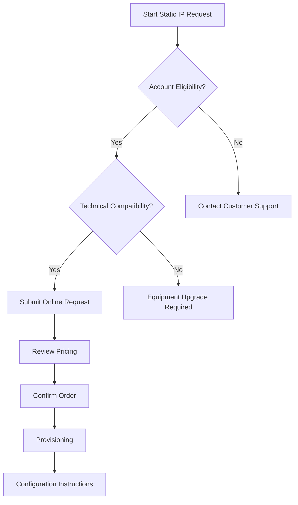
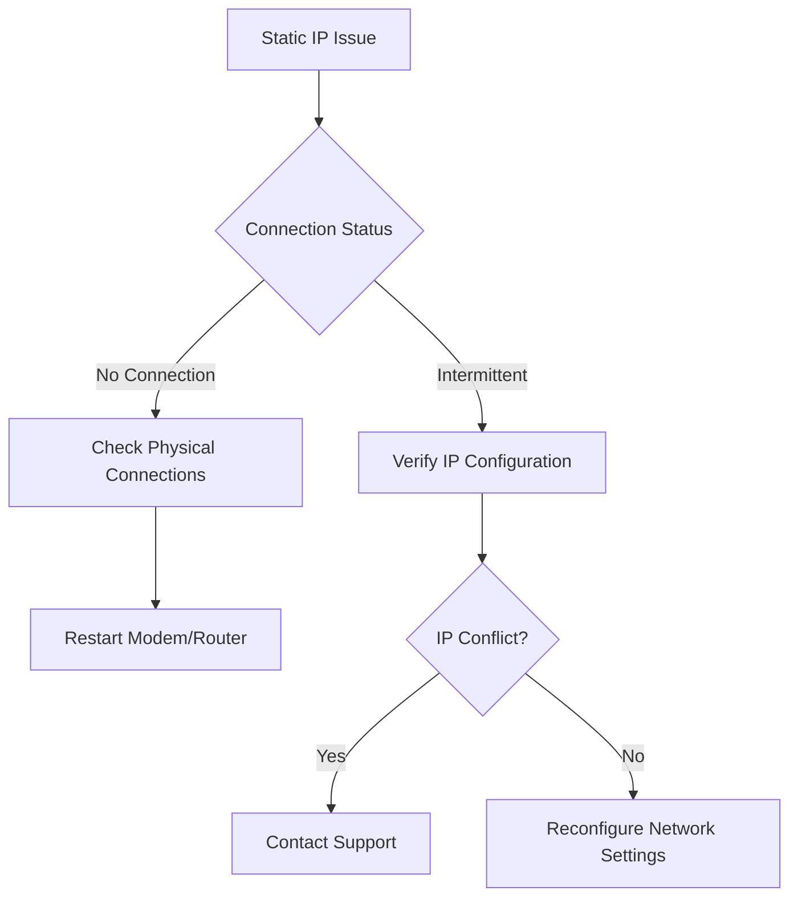

# Static IP Address Assignment - Instructions for Customers

## Overview
This runbook provides comprehensive guidance for customers seeking to request, configure, and manage a static IP address for their internet connection.

## Eligibility Requirements
- Active business or residential internet service plan
- Compatible networking equipment
- Additional monthly fee for static IP service

## Prerequisite Checks
### 1. Account Verification
- [ ] Current account in good standing
- [ ] Sufficient service tier for static IP allocation
- [ ] No outstanding balance

### 2. Technical Compatibility
- Supported connection types:
  - Fiber
  - Cable
  - DSL
- Supported router types:
  - Enterprise-grade routers
  - Commercial-grade modems
  - Compatible DOCSIS 3.0/3.1 devices

## Request Process Flowchart



## Configuration Instructions

### Windows Configuration
1. Open Network and Sharing Center
2. Click "Change adapter settings"
3. Right-click network connection
4. Select "Properties"
5. Configure IP address manually

### macOS Configuration
1. Open System Preferences
2. Navigate to Network
3. Select network interface
4. Choose "Manually" for configuration
5. Enter provided static IP details

### Linux Configuration
```bash
# Example netplan configuration
network:
  version: 2
  renderer: networkd
  ethernets:
    eth0:
      addresses: [192.168.1.100/24]
      gateway4: 192.168.1.1
      nameservers:
        addresses: [8.8.8.8, 1.1.1.1]
```

## Troubleshooting Decision Tree



## Common Configuration Parameters
- IP Address
- Subnet Mask
- Default Gateway
- DNS Servers

## Pricing Tiers
1. Residential Static IP
   - $5.99/month
   - Single static IP

2. Business Static IP
   - $14.99/month
   - Multiple IP block options

## Support Channels
- Online Support Portal
- 24/7 Technical Support
- Email Support
- Community Forums

## Legal and Compliance
- IP address allocation subject to change
- Must comply with acceptable use policy
- No guaranteed IP persistency

## Appendix
- Supported Network Equipment
- Troubleshooting Guides
- Configuration Templates

## Version Control
- Document Version: 2.1
- Last Updated: [Current Date]
- Revision Frequency: Quarterly

## Disclaimer
Configuration steps may vary based on specific network environment and equipment.

---

**Note:** Always consult official documentation or contact support for personalized assistance.