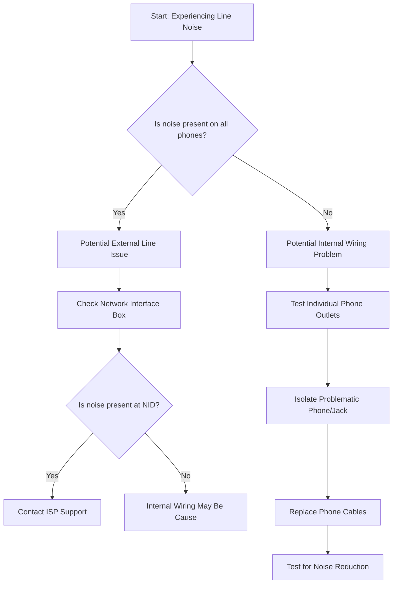

# Static or Noise on Landline - Troubleshooting Guide

## Overview
This guide provides step-by-step troubleshooting instructions for customers experiencing static, noise, or interference on their landline phone service.

## Preliminary Checks
### Initial Diagnostic Steps
1. Identify the type of noise:
   - Constant static
   - Intermittent crackling
   - Background humming
   - Line noise during specific times

## Troubleshooting Flowchart

## Detailed Troubleshooting Steps

### Step 1: Phone Equipment Verification
- Unplug all phones except one corded phone
- Use a known working phone to eliminate device-specific issues
- Check for:
  - Damaged phone cables
  - Faulty phone adapters
  - Wireless phone interference

### Step 2: Internal Wiring Inspection
1. Check all phone jack connections
2. Look for:
   - Loose connections
   - Visible wire damage
   - Corrosion on jacks

### Step 3: External Line Inspection
1. Locate Network Interface Device (NID)
2. Open NID cover
3. Plug test phone directly into NID jack
4. Check for noise/static

### Step 4: Interference Elimination
Potential interference sources:
- Electrical devices
- Wi-Fi routers
- Cordless phones
- Cell phone chargers
- Fluorescent lights

### Step 5: Advanced Diagnostics
If issues persist:
- Check for:
  - Ground loop problems
  - Electromagnetic interference
  - Line condition

## Recommended Actions

### If Problem Persists
1. Document specific noise characteristics
2. Note time of occurrence
3. Contact ISP Technical Support
4. Provide detailed troubleshooting steps already completed

## Troubleshooting Scenarios

### Scenario A: Constant Background Static
- Likely external line interference
- Requires professional line inspection

### Scenario B: Intermittent Noise
- Potential weather-related or environmental issue
- Check during different times of day

### Scenario C: Noise Only During Calls
- Possible equipment compatibility problem
- Check phone and line adapter settings

## Technical Specifications
- Acceptable Signal-to-Noise Ratio: > 40 dB
- Normal Line Impedance: 600 ohms
- Recommended Line Resistance: < 10 ohms

## Additional Resources
- [FCC Telephone Interference Guidelines](https://www.fcc.gov)
- Technical Support Contact: 1-800-SUPPORT
- Online Troubleshooting Portal: support.isp.com

## Diagnostic Codes
- NE001: No External Line Noise
- NE002: Potential Line Interference
- NE003: Internal Wiring Issue
- NE004: Equipment Malfunction

## Disclaimer
This guide provides general troubleshooting steps. Complex issues may require professional technical support.

---

**Last Updated:** [Current Date]
**Version:** 1.2