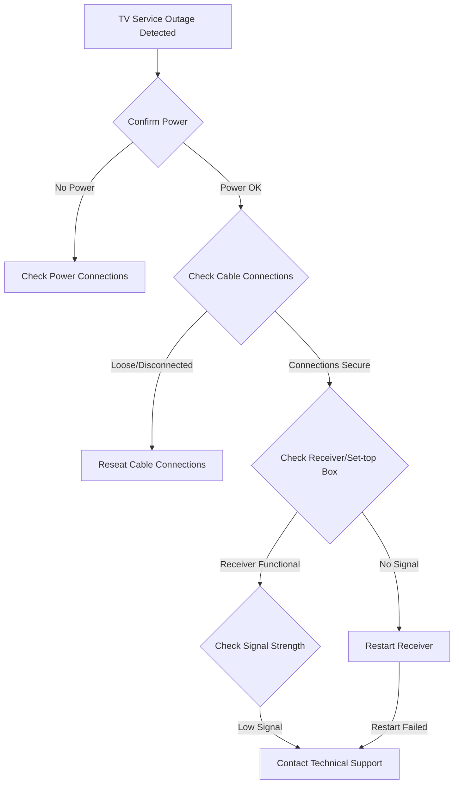

# TV Service Outage - Troubleshooting Guide

## Overview
This comprehensive guide provides step-by-step procedures for diagnosing and resolving TV service interruptions and signal loss.

## Quick Diagnostic Flowchart

## Troubleshooting Stages

### 1. Initial Diagnostic Checks
- [ ] Verify TV is powered on
- [ ] Confirm remote control is functioning
- [ ] Check all cable connections are secure

### 2. Power and Connection Verification
#### Power Issues
- Ensure power outlet is functional
  - Test outlet with another device
  - Check circuit breaker/fuse
- Verify power adapter/cord integrity
- Restart receiver/set-top box
  - Unplug for 60 seconds
  - Reconnect and power on

#### Cable Connection Checks
- Inspect coaxial cable connections
  - Verify tight, secure connections
  - Check for visible damage
- Verify cable splitter functionality
- Test direct connection to wall outlet

### 3. Receiver/Set-top Box Diagnostics
#### Basic Receiver Troubleshooting
- Check front panel indicator lights
- Perform soft reset
  - Use reset button
  - Power cycle device
- Verify HDMI/AV connections
- Check input source settings

#### Signal Diagnostics
- Access receiver signal strength menu
- Check signal quality indicators
  - Signal strength percentage
  - Signal quality metrics
- Reposition antenna/satellite dish if applicable

### 4. Advanced Troubleshooting
#### Network-Related Issues
- Check internet connectivity
- Verify modem/router status
- Restart networking equipment
- Run speed/connection tests

#### Software/Firmware
- Check for available software updates
- Verify receiver firmware version
- Perform factory reset if necessary

## Escalation Procedures
### When to Contact Support
- Persistent signal loss
- No improvement after complete troubleshooting
- Physical equipment damage
- Unexplained service interruptions

### Information to Provide
- Account number
- Equipment model
- Specific symptoms
- Troubleshooting steps already attempted

## Recommended Equipment
### Recommended Tools
- Coaxial cable tester
- Spare HDMI/AV cables
- Multimeter
- Flashlight

## Appendix
### Common Error Codes
| Error Code | Meaning | Recommended Action |
|-----------|---------|-------------------|
| E01 | No Signal | Check cable connections |
| E02 | Weak Signal | Adjust antenna/contact support |
| E03 | Authentication Failure | Verify account status |

### Technical Support Contact
- Phone: 1-800-TVHELP
- Email: support@isp.com
- Live Chat: www.isp.com/support

## Version Information
- Document Version: 2.1
- Last Updated: 2023-11-15
- Revision Schedule: Quarterly

## Legal Disclaimer
This troubleshooting guide is provided as a general reference. Specific issues may require professional technical support.