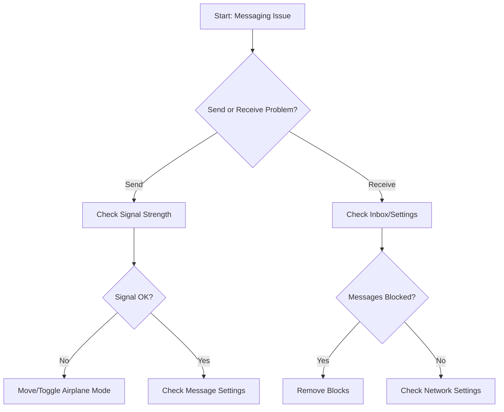

# Text Messaging Issues - Troubleshooting Guide

## Overview
This guide provides step-by-step troubleshooting for resolving text messaging problems on mobile devices.

## Preliminary Checks
### Device Compatibility
- Ensure your device supports text messaging
- Verify active mobile data or cellular service
- Check device has sufficient storage

## Troubleshooting Decision Tree

### Problem Category: Cannot Send Messages
1. Signal Strength
   - [ ] Check signal bars
   - [ ] Move to area with better reception
   - [ ] Toggle Airplane Mode ON/OFF

2. Message Settings
   - [ ] Verify messaging app is default
   - [ ] Check SMS/MMS settings
   - [ ] Confirm phone number formatting

3. Carrier Issues
   - [ ] Verify account is active
   - [ ] Check for carrier outages
   - [ ] Contact customer support

### Problem Category: Cannot Receive Messages
1. Inbox Capacity
   - [ ] Delete old messages
   - [ ] Clear message cache
   - [ ] Check storage availability

2. Network Settings
   - [ ] Verify cellular data is enabled
   - [ ] Reset network settings
   - [ ] Restart device

3. Blocking/Filters
   - [ ] Check blocked numbers list
   - [ ] Verify message filtering settings
   - [ ] Disable do not disturb mode

## Specific Platform Troubleshooting

### Android Devices
- Clear messaging app data
- Check Google Play Services
- Verify default messaging app

### iOS Devices
- Reset iMessage settings
- Check Apple ID messaging configuration
- Verify cellular settings

### Windows/Other Platforms
- Update messaging app
- Check system communication settings
- Verify account synchronization

## Advanced Troubleshooting

### Technical Diagnostics
- Run network diagnostic tools
- Check APN (Access Point Name) settings
- Verify carrier messaging center number

### Software Considerations
- Update device operating system
- Update messaging application
- Check for known software conflicts

## When to Escalate to Support
- Persistent messaging failures
- Error codes not resolved by guide
- Suspected hardware issues

## Recommended Tools
- Network signal analyzer apps
- Messaging diagnostic utilities
- Carrier-specific troubleshooting apps

## Contact Information
- Customer Support: [Phone Number]
- Technical Support Email: [Email Address]
- Online Support Portal: [URL]

## Version Information
- Last Updated: [Current Date]
- Version: 1.2
- Applicable Platforms: Android, iOS, Windows Mobile

## Legal Disclaimer
Troubleshooting steps are provided as general guidance. Individual device and carrier configurations may vary.

## Appendix
- Glossary of technical terms
- Common error code references
- Messaging protocol explanations

---

### Troubleshooting Flowchart

## Best Practices
- Regularly update device software
- Maintain adequate device storage
- Use official messaging applications
- Keep contact lists organized